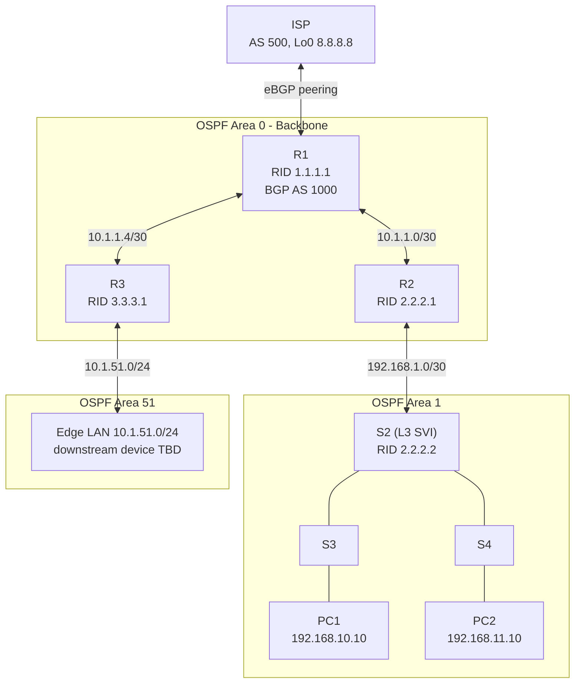

# Enterprise Network Design: VLANs, OSPF, and BGP Routing

## Overview

A comprehensive enterprise network implementation featuring switched LAN infrastructure with VTPv2, RSTP, and LACP EtherChannel, multi-area OSPF routing, and BGP peering with an Internet Service Provider. This lab simulates a complete enterprise network from access layer to WAN edge.

**Key Objectives:**

- Configure switched LAN with VLANs, VTPv2, and LACP EtherChannel
- Implement Rapid Spanning Tree Protocol (RSTP) with root bridge placement
- Configure multi-area OSPFv2 with route summarization
- Establish BGP peering with an ISP for external connectivity
- Validate end-to-end connectivity from PCs to external networks

---

## Table of Contents

- [Topology](#topology)
- [VLAN Plan](#vlan-plan)
- [Device Addressing](#device-addressing)
- [Part A: Enterprise LAN Configuration](#part-a-enterprise-lan-configuration)
- [Part B: OSPF Enterprise Routing](#part-b-ospf-enterprise-routing)
- [Part C: BGP Routing with ISP](#part-c-bgp-routing-with-isp)
- [Verification Steps](#verification-steps)
- [Key Takeaways](#key-takeaways)
- [Troubleshooting Reference](#troubleshooting-reference)
- [Completion Checklist](#completion-checklist)

---

## Topology



> **Note:** R3's Area 51 link was renumbered from the original design (see [Corrections](#corrections-made-during-review)) and doesn't yet terminate on a named device — swap in the real host/switch once confirmed.

## VLAN Plan

|VLAN #|VLAN Name|Network|Purpose|
|:--|:--|:--|:--|
|10|USER-10|192.168.10.0/24|End-user data (PC1)|
|11|USER-11|192.168.11.0/24|End-user data (PC2)|
|99|MGNT|192.168.99.0/24|Switch management|
|100|Native|N/A|Trunk native VLAN|
|999|Blackhole|N/A|Unused/disabled ports|

---

## Device Addressing

|Device|Interface|IP Address|OSPF Area / BGP|
|:--|:--|:--|:--|
|**R1**|G0/0 (to ISP)|6.6.6.6/30|BGP AS 1000|
||Lo0|1.1.1.1/32|OSPF Area 0|
||G0/1 (to R2)|10.1.1.1/30|OSPF Area 0|
||G0/2 (to R3)|10.1.1.5/30|OSPF Area 0|
|**R2**|G0/0 (to R1)|10.1.1.2/30|OSPF Area 0|
||Lo0|2.2.2.1/32|OSPF Area 1|
||G0/1 (to S2)|192.168.1.1/30|OSPF Area 1|
|**R3**|G0/0 (to R1)|10.1.1.6/30|OSPF Area 0|
||Lo0|3.3.3.1/32|OSPF Area 51|
||G0/1 (Area 51 edge LAN)|10.1.51.1/24|OSPF Area 51|
|**S2**|G0/2 (to R2, routed)|192.168.1.2/30|OSPF Area 1|
||VLAN 10 (SVI)|192.168.10.1/24|Gateway for PC1|
||VLAN 11 (SVI)|192.168.11.1/24|Gateway for PC2|
||VLAN 99 (SVI)|192.168.99.2/24|Management|
|**S3**|VLAN 99|192.168.99.3/24|Management|
|**S4**|VLAN 99|192.168.99.4/24|Management|
|**ISP**|(to R1)|6.6.6.5/30|BGP AS 500|
||Lo0|8.8.8.8|Google DNS (testing)|
|**PC1**|NIC|192.168.10.10/24|Gateway: 192.168.10.1|
|**PC2**|NIC|192.168.11.10/24|Gateway: 192.168.11.1|

---

## Part A: Enterprise LAN Configuration

### VTPv2 Configuration

VTP (VLAN Trunking Protocol) centrally manages VLAN creation across all switches.

**On S2 (VTP Server):**

```
vtp domain CST8378
vtp version 2
vtp password cisco
vtp mode server
```

**On S3 and S4 (VTP Clients):**

```
vtp domain CST8378
vtp version 2
vtp password cisco
vtp mode client
```

### VLAN Creation

**On S2** (VLANs propagate to S3/S4 automatically via VTP):

```
vlan 10
 name USER-10
vlan 11
 name USER-11
vlan 99
 name MGNT
vlan 100
 name Native
vlan 999
 name Blackhole
```

### Switch Virtual Interface (SVI) Configuration

SVIs provide Layer 3 routing between VLANs and serve as default gateways.

**On S2:**

```
interface vlan 10
 ip address 192.168.10.1 255.255.255.0
 no shutdown

interface vlan 11
 ip address 192.168.11.1 255.255.255.0
 no shutdown

interface vlan 99
 ip address 192.168.99.2 255.255.255.0
 no shutdown
```

**On S3:**

```
interface vlan 99
 ip address 192.168.99.3 255.255.255.0
 no shutdown
```

**On S4:**

```
interface vlan 99
 ip address 192.168.99.4 255.255.255.0
 no shutdown
```

### Routed Port Configuration

**On S2, G0/2 as a routed port (connects to R2):**

```
interface GigabitEthernet0/2
 no switchport
 ip address 192.168.1.2 255.255.255.252
 no shutdown
```

### Blackhole VLAN (Disable Unused Ports)

**On S2 (Fa0/5-24, G0/1):**

```
interface range fastEthernet 0/5-24, gigabitEthernet 0/1
 switchport mode access
 switchport access vlan 999
 shutdown
```

**On S3 and S4 (Fa0/5-23, G0/1-2):**

```
interface range fastEthernet 0/5-23, gigabitEthernet 0/1-2
 switchport mode access
 switchport access vlan 999
 shutdown
```

### Host Ports

**On S3, Fa0/24 (USER-10 VLAN for PC1):**

```
interface fastEthernet 0/24
 switchport mode access
 switchport access vlan 10
 no shutdown
```

**On S4, Fa0/24 (USER-11 VLAN for PC2):**

```
interface fastEthernet 0/24
 switchport mode access
 switchport access vlan 11
 no shutdown
```

---

### LACP EtherChannel Configuration

LACP (Link Aggregation Control Protocol) bundles multiple physical links into a single logical trunk for increased bandwidth and redundancy.

#### S2 Port Channels (Po1 → S3, Po2 → S4)

```
interface port-channel 1
 switchport mode trunk
 switchport trunk native vlan 100
 switchport trunk allowed vlan 1,10,11,99,100
 no shutdown

interface port-channel 2
 switchport mode trunk
 switchport trunk native vlan 100
 switchport trunk allowed vlan 1,10,11,99,100
 no shutdown

interface range fastEthernet 0/1-2
 channel-group 1 mode active
 switchport mode trunk
 switchport trunk native vlan 100
 switchport trunk allowed vlan 1,10,11,99,100
 no shutdown

interface range fastEthernet 0/3-4
 channel-group 2 mode active
 switchport mode trunk
 switchport trunk native vlan 100
 switchport trunk allowed vlan 1,10,11,99,100
 no shutdown
```

#### S3 Port Channels (Po1 → S2, Po3 → S4)

```
interface port-channel 1
 switchport mode trunk
 switchport trunk native vlan 100
 switchport trunk allowed vlan 1,10,11,99,100
 no shutdown

interface port-channel 3
 switchport mode trunk
 switchport trunk native vlan 100
 switchport trunk allowed vlan 1,10,11,99,100
 no shutdown

interface range fastEthernet 0/1-2
 channel-group 1 mode active
 switchport mode trunk
 switchport trunk native vlan 100
 switchport trunk allowed vlan 1,10,11,99,100
 no shutdown

interface range fastEthernet 0/3-4
 channel-group 3 mode active
 switchport mode trunk
 switchport trunk native vlan 100
 switchport trunk allowed vlan 1,10,11,99,100
 no shutdown
```

#### S4 Port Channels (Po1 → S2, Po3 → S3)

```
interface port-channel 1
 switchport mode trunk
 switchport trunk native vlan 100
 switchport trunk allowed vlan 1,10,11,99,100
 no shutdown

interface port-channel 3
 switchport mode trunk
 switchport trunk native vlan 100
 switchport trunk allowed vlan 1,10,11,99,100
 no shutdown

interface range fastEthernet 0/1-2
 channel-group 1 mode active
 switchport mode trunk
 switchport trunk native vlan 100
 switchport trunk allowed vlan 1,10,11,99,100
 no shutdown

interface range fastEthernet 0/3-4
 channel-group 3 mode active
 switchport mode trunk
 switchport trunk native vlan 100
 switchport trunk allowed vlan 1,10,11,99,100
 no shutdown
```

> Po3 on S3 and S4 implies a direct S3–S4 link for redundancy (not drawn in the topology diagram above) — worth confirming and adding to the diagram if that link actually exists. RSTP would block the redundant path to prevent a loop.

### Rapid Spanning Tree Protocol (RSTP)

**Configure RSTP on all switches:**

```
spanning-tree mode rapid-pvst
```

**Set S2 as Root Bridge for all VLANs:**

```
spanning-tree vlan 1 root primary
spanning-tree vlan 10 root primary
spanning-tree vlan 11 root primary
spanning-tree vlan 99 root primary
spanning-tree vlan 100 root primary
spanning-tree vlan 999 root primary
```

---

## Part B: OSPF Enterprise Routing

### Router Interface Configuration

**On R1:**

```
interface loopback 0
 ip address 1.1.1.1 255.255.255.255
 no shutdown

interface GigabitEthernet0/0
 ip address 6.6.6.6 255.255.255.252
 no shutdown

interface GigabitEthernet0/1
 ip address 10.1.1.1 255.255.255.252   # to R2
 no shutdown

interface GigabitEthernet0/2
 ip address 10.1.1.5 255.255.255.252   # to R3
 no shutdown
```

**On R2:**

```
interface loopback 0
 ip address 2.2.2.1 255.255.255.255
 no shutdown

interface GigabitEthernet0/0
 ip address 10.1.1.2 255.255.255.252   # to R1
 no shutdown

interface GigabitEthernet0/1
 ip address 192.168.1.1 255.255.255.252 # to S2
 no shutdown
```

**On R3:**

```
interface loopback 0
 ip address 3.3.3.1 255.255.255.255
 no shutdown

interface GigabitEthernet0/0
 ip address 10.1.1.6 255.255.255.252   # to R1
 no shutdown

interface GigabitEthernet0/1
 ip address 10.1.51.1 255.255.255.0    # Area 51 edge LAN
 no shutdown
```

### OSPF Configuration

**OSPF Process ID:** 123 **Router IDs:** As shown in the addressing table

**On R1:**

```
router ospf 123
 router-id 1.1.1.1
 auto-cost reference-bandwidth 1000   # Accommodates Gigabit links
 network 1.1.1.1 0.0.0.0 area 0
 network 10.1.1.0 0.0.0.3 area 0
 network 10.1.1.4 0.0.0.3 area 0
```

**On R2:**

```
router ospf 123
 router-id 2.2.2.1
 auto-cost reference-bandwidth 1000
 network 2.2.2.1 0.0.0.0 area 1
 network 10.1.1.0 0.0.0.3 area 0
 network 192.168.1.0 0.0.0.3 area 1
```

**On R3:**

```
router ospf 123
 router-id 3.3.3.1
 auto-cost reference-bandwidth 1000
 network 3.3.3.1 0.0.0.0 area 51
 network 10.1.1.4 0.0.0.3 area 0
 network 10.1.51.0 0.0.0.255 area 51
```

**On S2:**

```
router ospf 123
 router-id 2.2.2.2
 auto-cost reference-bandwidth 1000
 network 192.168.1.2 0.0.0.0 area 1
 network 192.168.10.0 0.0.0.255 area 1
 network 192.168.11.0 0.0.0.255 area 1
 network 192.168.99.0 0.0.0.255 area 1
```

### Hello Interval and DR Priority Configuration

**On R2 and S2 (link 192.168.1.0/30):**

On R2:

```
interface GigabitEthernet0/1
 ip ospf hello-interval 5
 ip ospf dead-interval 20
 ip ospf priority 255
```

_(R2 becomes Designated Router)_

On S2:

```
interface GigabitEthernet0/2
 ip ospf hello-interval 5
 ip ospf dead-interval 20
 ip ospf priority 0
```

### Default Route Propagation

**On R1 (default route to ISP):**

```
ip route 0.0.0.0 0.0.0.0 6.6.6.5
```

**Propagate to OSPF domain:**

```
router ospf 123
 default-information originate
```

### Route Summarization

**On R2 (summarize Area 1 networks):**

```
router ospf 123
 area 1 range 192.168.0.0 255.255.128.0
```

**On R3 (summarize Area 51 networks):**

```
router ospf 123
 area 51 range 10.1.48.0 255.255.252.0
```

---

## Part C: BGP Routing with ISP

### BGP Configuration on R1

**BGP AS:** 1000 (Enterprise) **Neighbor AS:** 500 (ISP) **Router ID:** 1.1.1.1

```
router bgp 1000
 bgp router-id 1.1.1.1
 neighbor 6.6.6.5 remote-as 500
 neighbor 6.6.6.5 description ISP
 network 192.168.10.0 mask 255.255.255.0
 network 192.168.11.0 mask 255.255.255.0
 network 192.168.99.0 mask 255.255.255.0
 network 10.1.1.0 mask 255.255.255.252
 network 10.1.1.4 mask 255.255.255.252
 network 1.1.1.1 mask 255.255.255.255
```

**Alternative (redistribute connected):**

```
router bgp 1000
 redistribute connected
```

---

## Verification Steps

### 1. OSPF Neighbor Verification

```
show ip ospf neighbor
show ip ospf interface brief
show ip route ospf
```

### 2. BGP Verification

```
show ip bgp summary
show ip bgp neighbors
show ip route bgp
```

### 3. VLAN and Trunk Verification

```
show vlan brief
show interfaces trunk
show etherchannel summary
show spanning-tree
```

### 4. Connectivity Tests

|Source|Destination|Expected Result|
|:--|:--|:--|
|PC1|192.168.99.2|Successful ping|
|PC1|3.3.3.1|Successful ping|
|PC1|8.8.8.8|Successful ping (via BGP)|
|PC2|192.168.99.4|Successful ping|
|PC2|2.2.2.1|Successful ping|
|PC2|8.8.8.8|Successful ping (via BGP)|
|S2|192.168.10.10|Successful ping|
|S3|3.3.3.1|Successful ping|
|S4|2.2.2.1|Successful ping|
|R3|8.8.8.8|Successful ping (via BGP)|

---

## Key Takeaways

|Concept|Lesson|
|:--|:--|
|**VTPv2**|Centralized VLAN management reduces manual configuration; ensure server/client mode consistency|
|**Blackhole VLAN**|Disabling unused ports and assigning them to a blackhole VLAN improves security and prevents unauthorized access|
|**LACP EtherChannel**|Provides link redundancy and increased bandwidth; ensures high availability|
|**RSTP Root Bridge**|Placing the root bridge at S2 ensures optimal spanning-tree topology for all VLANs|
|**OSPF Reference Bandwidth**|Must be adjusted for Gigabit links to calculate accurate metrics (default 100 Mbps makes all Gigabit links cost 1)|
|**Hello/Dead Interval**|Must match on both ends of an OSPF adjacency; DR priority determines designated router election|
|**Route Summarization**|Reduces routing table size and LSDB flooding — pick summary ranges that don't overlap another area's address space|
|**default-information originate**|Required to propagate the default route into the OSPF domain; easy to forget|
|**BGP**|Exchanges routing information with the ISP; networks must be advertised to become externally reachable|

---

## Troubleshooting Reference

|Issue|Likely Cause|Fix|
|:--|:--|:--|
|VTP not propagating VLANs|Domain/password mismatch; version mismatch|Verify domain, password, and VTP version on all switches|
|OSPF neighbor not forming|Hello/dead timer mismatch; network mismatch|Match timers; verify network statements|
|No BGP neighbor adjacency|Wrong AS number; IP unreachable|Verify AS numbers; check route to neighbor|
|Default route not in OSPF table|`default-information originate` missing|Add under the OSPF process|
|EtherChannel not bundling|Mode mismatch; port config mismatch|Verify both sides are `active`; ensure consistent config|
|PC cannot reach external network|BGP not advertising; missing default route|Verify BGP advertisements; check default route propagation|
|Overlapping subnets across areas|Address plan reused a range already in use elsewhere|Lay out the full address plan before assigning area ranges (see Corrections below)|

---

## Completion Checklist

**Part A: Enterprise LAN**

- [x] VTPv2 configured (S2 server, S3/S4 clients)
- [x] VLANs 10, 11, 99, 100, 999 created
- [x] SVIs configured with correct IPs
- [x] G0/2 on S2 configured as a routed port
- [x] Unused ports assigned to the Blackhole VLAN and disabled
- [x] Host ports configured (S3 Fa0/24 in VLAN 10, S4 Fa0/24 in VLAN 11)
- [x] LACP active mode configured on all port channels
- [x] Trunk links configured with allowed VLANs and native VLAN 100
- [x] RSTP enabled with S2 as root bridge

**Part B: OSPF Enterprise Routing**

- [x] All router interfaces configured and activated
- [x] OSPF process 123 with correct router IDs
- [x] Reference bandwidth adjusted for Gigabit links
- [x] All networks advertised except the raw ISP link
- [x] Hello interval 5s / dead interval 20s on the R2–S2 link
- [x] R2 configured as DR with highest priority
- [x] Default route to ISP configured and propagated
- [x] Area 1 summarized (`192.168.0.0/17`)
- [x] Area 51 summarized (`10.1.48.0/22`), renumbered off the Area 0 backbone

**Part C: BGP Routing**

- [x] BGP configured on R1 with AS 1000
- [x] Neighbor relationship established with ISP (AS 500)
- [x] Router ID 1.1.1.1 assigned
- [x] Enterprise networks advertised

**Verification**

- [x] PC1 and PC2 reach R3's loopback
- [x] PC1 and PC2 reach S2, S3, S4
- [x] S2, S3, S4 reach all loopbacks
- [x] PC1 and PC2 reach 8.8.8.8
- [x] S2, S3, S4 reach 8.8.8.8

---

## Corrections Made During Review

A few addressing inconsistencies from the original design were caught and fixed here:

1. **R3 G0/1 conflicted with R1 G0/1.** Both were originally addressed `10.1.1.1`. R3's Area 51 edge interface is now `10.1.51.1/24`, clear of the Area 0 backbone links (`10.1.1.0/30`, `10.1.1.4/30`).
2. **Area 51's summary range overlapped Area 0.** The original `area 51 range 10.1.0.0/22` covered the same address space as the Area 0 backbone. It's now `10.1.48.0/22`, matching R3's renumbered LAN.
3. **The "R3 → S2" link didn't match the rest of the topology.** S2 only has one Layer 3 uplink (G0/2, to R2). R3's downstream interface is now documented as a standalone Area 51 edge LAN, with the far-end device left as a TODO until confirmed.
4. **Addressing table typos.** R2's and R3's "to R1" rows previously listed R1's own address on those links instead of their own (`10.1.1.2/30` and `10.1.1.6/30`, respectively).
5. **Area 1 summary tightened.** `192.168.0.0/16` became `192.168.0.0/17` — same subnets covered, less wasted address space.

---

**Environment:** [Cisco Packet Tracer]
**College:** ALGONQUIN COLLEGE

---