# Cloud Helpdesk Ticketing System: Multi-Tenant Support for Lumora Impact & Clear Roots

## Overview

This project was part of the value-added services for my Emerging Technologies Project. The effort was entirely independent and involved implementing two segmented ticketing systems for the two companies that we, as the Managed Service Provider (MSP), are responsible for supporting: **Lumora Impact** and **Clear Roots**.

The solution uses the **Spiceworks Helpdesk Service**—a cloud-based ticketing platform—to provide each client with a dedicated, branded support portal.

**Key Objectives:**

- Deploy a cloud-based ticketing system for two separate client organizations
- Provide each organization with its own branded login portal
- Enable client-side ticket submission via email-verified accounts
- Establish a technician dashboard for ticket management and resolution
- Implement ticket lifecycle management (submission → assignment → resolution → closing)

---

## Table of Contents

- [System Architecture & Workflow](#system-architecture--workflow)
- [Skills Demonstrated](#skills-demonstrated)
- [Implementation Steps](#implementation-steps)
- [Key Takeaways](#key-takeaways)
- [Completion Checklist](#completion-checklist)

---

## System Architecture & Workflow

```
Lumora Impact / Clear Roots → Spiceworks Helpdesk (Cloud) → Technician Dashboard → Ticket Resolution
```

```
┌─────────────────────────────────────────────────────────────────────────────┐
│                         CLOUD HELP DESK SYSTEM                              │
│                         (Spiceworks Platform)                               │
├─────────────────────────────────────────────────────────────────────────────┤
│                                                                             │
│  ┌────────────────────────────────────────────────────────────────────┐     │
│  │                         ADMINISTRATIVE LAYER                       │     │
│  │                                                                    │     │
│  │     ┌─────────────────────┐  ┌─────────────────────────────────┐   │     │
│  │     │   Lumora Impact     │  │       Clear Roots               │   │     │
│  │     │   Organization      │  │       Organization              │   │     │
│  │     └─────────────────────┘  └─────────────────────────────────┘   │     │
│  └────────────────────────────────────────────────────────────────────┘     │
│                                    │                                        │
│                                    ▼                                        │
│  ┌────────────────────────────────────────────────────────────────────┐     │
│  │                     TECHNICIAN DASHBOARD                           │     │
│  │                                                                    │     │
│  │    • Ticket assignment    • Priority management                    │     │
│  │    • Status tracking      • Due date configuration                 │     │
│  │    • Category selection   • Client communication (chat)            │     │
│  │    • Organization routing  • Ticket closure                        │     │
│  └────────────────────────────────────────────────────────────────────┘     │
│                                                                             │
└─────────────────────────────────────────────────────────────────────────────┘
```

A text-native version, useful anywhere the box diagram above doesn't render cleanly (e.g. viewing raw markdown):

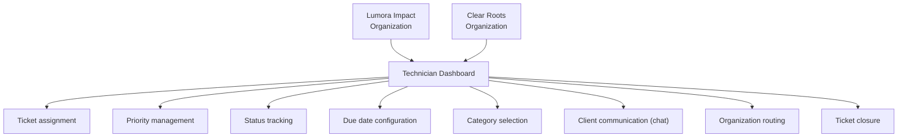

### Environment

|Component|Specification|
|:--|:--|
|**Platform**|Spiceworks Helpdesk (Cloud-hosted)|
|**Client 1**|Lumora Impact|
|**Client 2**|Clear Roots|
|**Access Method**|Web portal via desktop shortcuts|
|**Authentication**|Email-based user accounts|
|**Communication**|Email notifications for ticket creation and updates|

---

## Skills Demonstrated

|Category|Skills|
|:--|:--|
|**IT Service Management**|Helpdesk system configuration; multi-tenant ticketing architecture|
|**User Administration**|Account creation and management; role-based access control|
|**Workflow Design**|Ticket lifecycle management; client-technician communication flow|
|**Documentation**|Process documentation; user guide preparation|
|**Integration**|Email-based authentication; automated notification systems|

---

## Implementation Steps

### 1. Prerequisites & Organization Setup

#### Technical Requirements

- Internet connection
- A user account linked with a valid email address

#### Organization Provisioning

- Each company has its own user directory within the Spiceworks platform
- Administrators create accounts with company email addresses
- Users are assigned to their respective organizations

---

### 2. User & Employee Administration

#### Lumora Impact

**Lumora Users:**

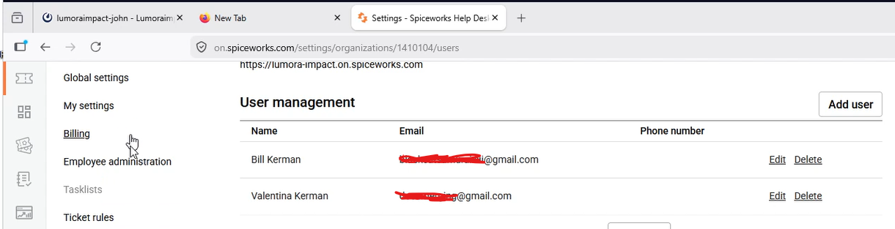

**Employee Administration:**

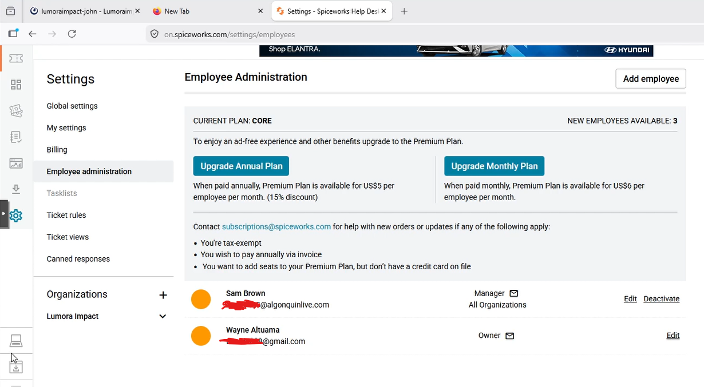

---

### 3. Client-Side Ticket Workflow

#### Workflow Overview

1. **Access:** On the desktop of every client device is a shortcut to the helpdesk login portal of their company, labeled "Helpdesk."
2. **Authentication:** Users must log in with their company email—an email that is registered to an account created by a helpdesk administrator.
3. **Email Confirmation:** Upon login, users receive a link via email pointing to their company's client ticketing portal.
4. **Ticket Management:**
    - The portal includes a simple ticket submission form
    - Open ticket tracking system
    - Tickets remain in the client's history until the issue is resolved and the ticket is closed

> **Note:** Email verification adds a layer of security and ensures users are accessing the correct organization's portal.

#### Lumora Impact

**Login Portal**

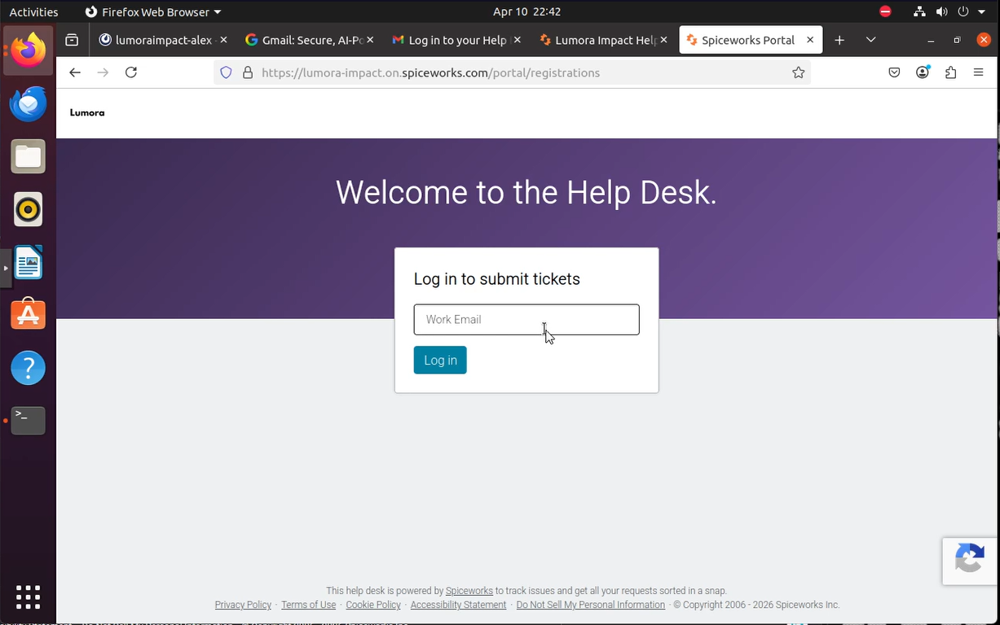

**Email Verification**

Upon entering your email and logging in, you receive a verification email:

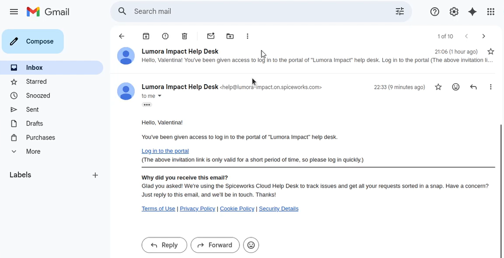

**Ticket Portal**

After clicking the link in the email, users are directed to the ticket portal:

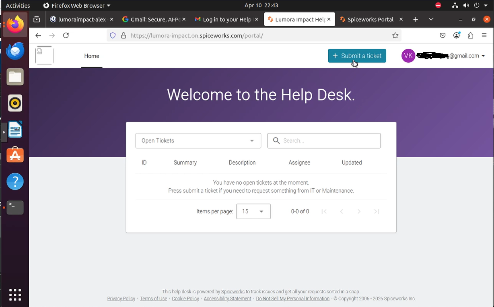

**Ticket Submission**

Upon clicking "Submit a Ticket," users are presented with the ticket creation form:

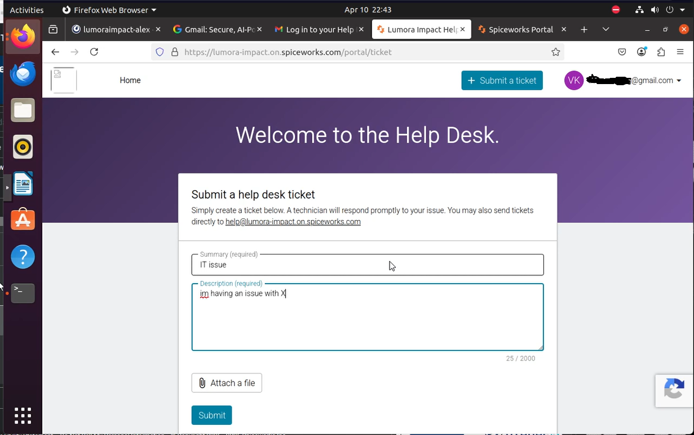

#### Clear Roots

**Ticket Portal**

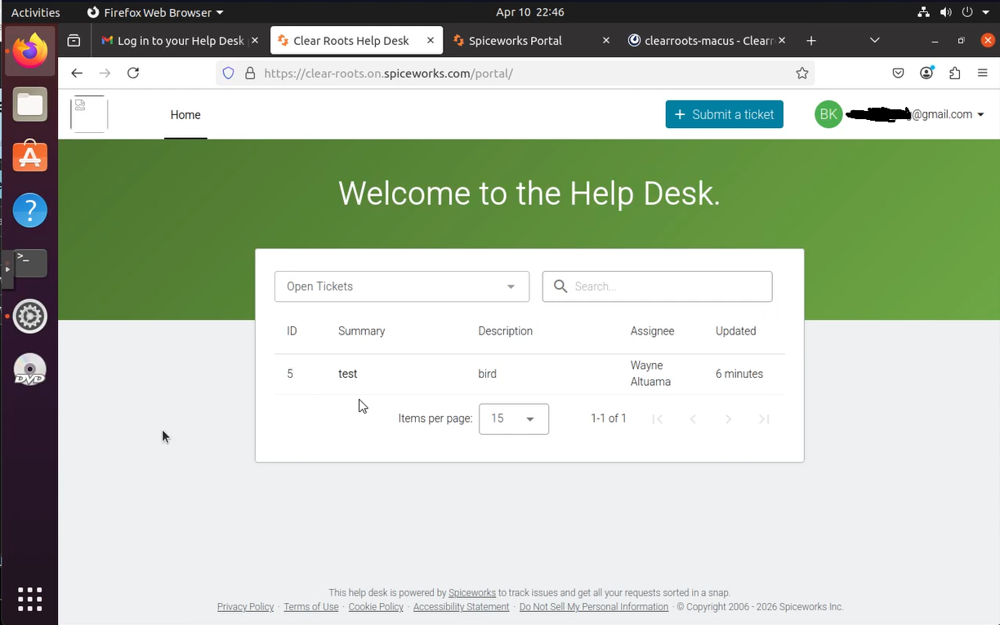

**Ticket Submission**

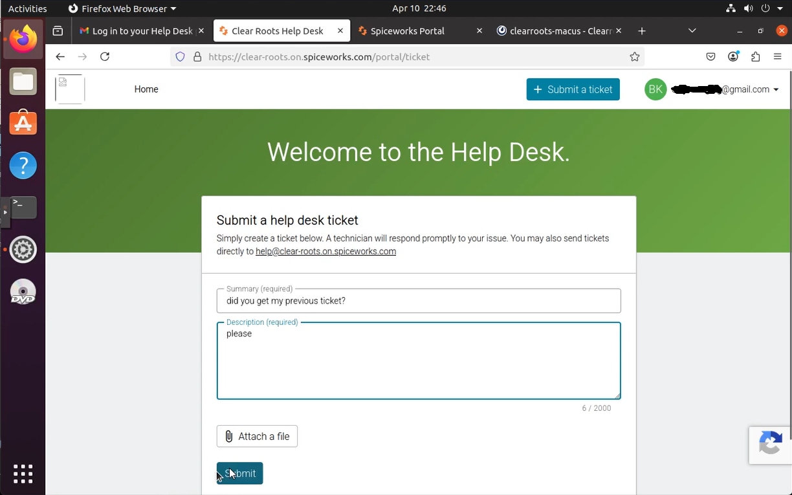

---

### 4. Technician-Side Ticket Management

#### Workflow Overview

1. **Ticket Visibility:** New tickets appear in the helpdesk dashboard for the respective organization.
2. **Ticket Management Tools:**
    - Organization assignment
    - User identification and contact management
    - Technician assignment
    - Status and priority configuration
    - Due date creation and tracking
    - Issue categorization (unspecified, email, hardware, maintenance, network, printer, software, other)
3. **Communication:** Real-time chat with the ticket creator for clarification and updates.
4. **Ticket Closure:** Both the client and helpdesk technician can close tickets upon resolution.

#### Ticket Management Tools Reference

|Tool|Description|
|:--|:--|
|**Organization**|View and verify the organization the ticket belongs to|
|**User**|Identify and contact the user who created the ticket|
|**Technician Assignment**|Assign or reassign the ticket to a different technician|
|**Status**|Update ticket status (New, In Progress, Resolved, Closed)|
|**Priority**|Set priority level (Low, Medium, High, Urgent)|
|**Due Date**|Create or modify the ticket due date|
|**Category**|Categorize the issue (Unspecified, Email, Hardware, Maintenance, Network, Printer, Software, Other)|
|**Communication**|Chat with the user who created the ticket in real-time|

#### Lumora Impact

**Technician View**

Once a ticket is submitted, the helpdesk technician sees it in the Lumora-facing ticketing system:

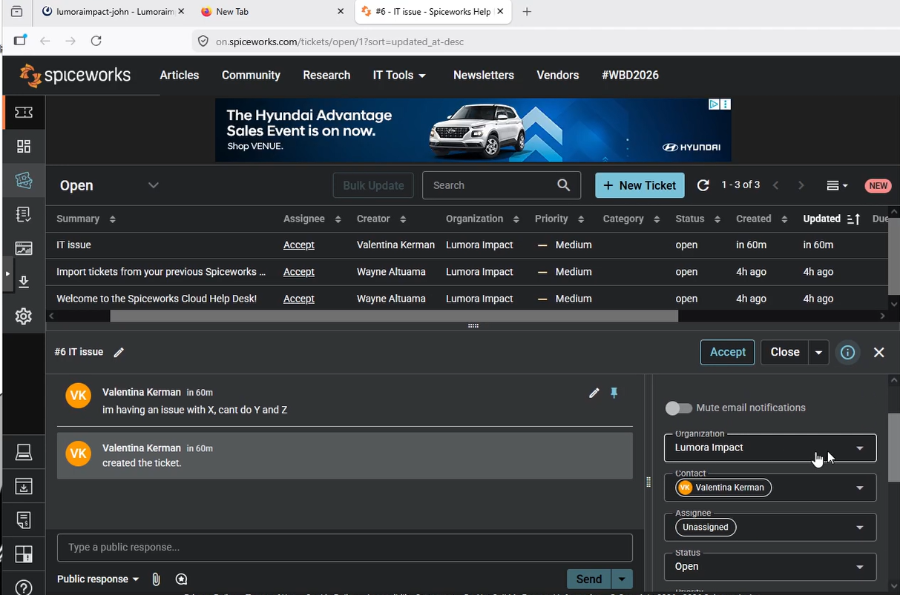

**Ticket Closure**

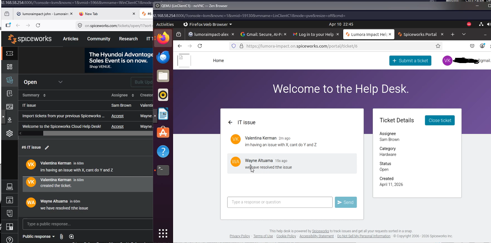

> **Note:** Both the client and the helpdesk technician can close the ticket.

#### Clear Roots

**Technician Dashboard**

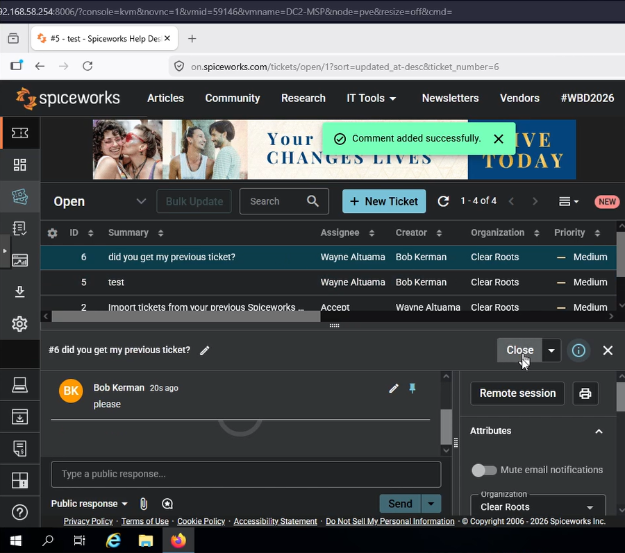

---

### 5. Ticket Routing & Notifications

#### Ticket Routing

- Tickets submitted by a user are automatically associated with their organization
- Technicians can view and manage tickets for either organization
- Organization context is maintained throughout the ticket lifecycle

#### Notification System

- Email notifications are sent to users upon login (portal link)
- Email notifications can be configured for status changes
- Real-time chat within the ticket interface

---

### 6. Access Control & Verification

#### Client-Level Access

- Users can only see their own tickets (self-service)

#### Technician & Administrator Access

- Technicians can view all tickets for assigned organization(s)
- Administrators have full system access

---

## Key Takeaways

|Concept|Lesson|
|:--|:--|
|**Multi-Tenant Design**|Single helpdesk instance can serve multiple organizations while maintaining data isolation and branded experiences|
|**Email Verification**|Adds a layer of security and ensures users are accessing the correct organization's portal|
|**Ticket Lifecycle**|Clear workflow from submission to closure provides accountability and traceability|
|**Client Self-Service**|Empowers users to submit and track tickets without technician intervention|
|**Technician Tools**|Comprehensive management features enable efficient ticket resolution|
|**Communication**|Integrated chat allows real-time collaboration without separate communication channels|

---

## Completion Checklist

**Client-Facing Features:**

- [x] Each company has a dedicated login portal
- [x] Users authenticate with company email accounts
- [x] Email verification link delivered upon login
- [x] Simple ticket submission form available
- [x] Open ticket tracking accessible to users
- [x] Ticket history persists until resolution

**Technician-Facing Features:**

- [x] Organization identification on tickets
- [x] User contact information visible
- [x] Technician assignment capability
- [x] Status and priority management
- [x] Due date functionality
- [x] Issue categorization options
- [x] Real-time chat with users

**Administration:**

- [x] User account creation and management
- [x] Employee administration interface
- [x] Organization-specific ticket routing
- [x] Ticket closure permissions (client + technician)

---

**Platform:** Spiceworks Helpdesk (Cloud)

**Related Project:** [Emerging Technologies MSP](./Emerging-Tech-MSP.md)

---