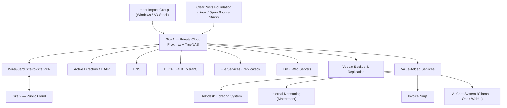

# MSP Infrastructure Design & Deployment: Lumora Impact Group & ClearRoots Foundation

## Overview

This project was the CST8248 Emerging Technologies term project, built by **Team DOS** (Group 4) at Algonquin College. The team acted as a Managed Service Provider (MSP), designing and deploying a hybrid private/public cloud infrastructure for two client organizations with very different needs: **Lumora Impact Group**, a Toronto-based subscription-first nonprofit, and **ClearRoots Foundation**, an open-source-first nonprofit operating in South Asia and East Africa.

The environment spans two physical sites connected over a secure site-to-site VPN, and includes full core infrastructure (virtualization, storage, Active Directory/LDAP, DNS, DHCP, file services, backups) plus a set of value-added services layered on top, including a Cloud Helpdesk Ticketing System for client support.

**Key Objectives:**

- Design and deploy a private cloud (Site 1) and public cloud (Site 2) environment for two isolated client organizations
- Provide each client with independent identity, name resolution, addressing, and file services appropriate to their platform preference (Windows/AD vs. Linux/LDAP)
- Establish secure site-to-site connectivity between the MSP's private and public infrastructure
- Implement fault-tolerant DHCP and replicated file storage for both clients
- Deploy a centralized backup strategy with off-site redundancy
- Deliver value-added services beyond the base requirements, including a Helpdesk Ticketing System, internal messaging, an invoicing platform, and an internally hosted AI chat system

---

## Table of Contents

- [System Architecture & Topology](#system-architecture--topology)
- [Team & Roles](#team--roles)
- [Skills Demonstrated](#skills-demonstrated)
- [Discussion 1: Physical Infrastructure & Network](#discussion-1-physical-infrastructure--network)
- [Discussion 2: Deployed Services](#discussion-2-deployed-services)
- [Discussion 3: Design Decisions & Value-Added Services](#discussion-3-design-decisions--value-added-services)
- [Key Takeaways](#key-takeaways)
- [Completion Checklist](#completion-checklist)
- [Related Projects](#related-projects)
- [References](#references)

---

## System Architecture & Topology

```
Lumora Impact Group / ClearRoots Foundation
              │
              ▼
   Site 1 (Private Cloud, T114a)  ◄──WireGuard VPN──►  Site 2 (Public Cloud, T120)
   Proxmox Hypervisor + TrueNAS Storage
              │
   ┌──────────┴───────────────────────────┐
   │                                       │
Company 1 (Lumora)                Company 2 (ClearRoots)
Windows Server / AD / DNS / DHCP  Linux / OpenLDAP / BIND9 / ISC DHCP
DFS File Replication              GlusterFS Replication
IIS Web Server (DMZ)              Apache2 Web Server (DMZ)
```



### Environment

|Component|Specification|
|:--|:--|
|**Hypervisor**|Proxmox VE (Site 1), DL380 host|
|**Storage**|TrueNAS, ZFS, NFS/SMB/iSCSI, 8× 2 TB disks|
|**Site Connectivity**|WireGuard site-to-site VPN between two pfSense routers|
|**Company 1 Platform**|Windows Server 2019 (Active Directory, DNS, DHCP, IIS)|
|**Company 2 Platform**|Ubuntu Linux (OpenLDAP, BIND9, ISC DHCP, Apache2, GlusterFS)|
|**Backup**|Veeam Backup & Replication 13.0.1.2067 (Community Edition)|
|**Remote Access**|RDP/SSH via DNAT port forwarding through jumpboxes|

---

## Team & Roles

| Team Member          | Primary Area                                                          | Value-Added Service                                            |
| :------------------- | :-------------------------------------------------------------------- | :------------------------------------------------------------- |
| Samuel Brown         | Backup infrastructure, storage, VM deployment                         | Internal messaging (Mattermost) for Company 1 & 2              |
| **Wayne Altuama**    | Project management, MSP configuration, Site 2 networking              | Helpdesk Ticketing System — separate portals for Company 1 & 2 |
| Zaber Ali            | Site 1 networking, VM configuration, site-to-site VPN, DHCP/DNS/HTTPS | Invoice Ninja for Company 1 & 2                                |
| Mudassir Q           | Active Directory / LDAP, domain controller configuration              | AI chat system (Ollama + Open WebUI) for Company 1 & 2         |
| Zaid                 | Tailscale, TrueNAS installation                                       | —                                                              |


---

## Skills Demonstrated

|Category|Skills|
|:--|:--|
|**Virtualization**|Proxmox hypervisor configuration, disk/storage isolation, VM deployment|
|**Storage**|TrueNAS pool/volume design, NFS, SMB, iSCSI target/initiator configuration|
|**Networking**|VLAN planning, stateful firewall segmentation, DMZ design, site-to-site WireGuard VPN|
|**Identity & Directory Services**|Active Directory Domain Services (OU/group/user design), OpenLDAP directory structure|
|**Name Resolution & Addressing**|Microsoft DNS & BIND9 (forward/reverse zones, forwarders), fault-tolerant split-scope DHCP|
|**File Services**|DFS Namespace/Replication (Windows), GlusterFS replicated volumes (Linux)|
|**Backup & DR**|Veeam Backup & Replication job design, off-site repository replication|
|**Web Hosting**|IIS and Apache2 DMZ web servers with firewall-restricted access|
|**Documentation**|Formal technical handover report authored to a professional, multi-audience standard|

---

## Discussion 1: Physical Infrastructure & Network

### 1.1 Physical Hardware Setup

Site 1 hosts the hypervisor and storage servers on a structured, color-coded patch panel with dedicated IPMI on each server for remote monitoring and recovery.

|Device|Location|Role|IPMI IP|Management IP|Notes|
|:--|:--|:--|:--|:--|:--|
|DL380|Site 1|Proxmox|192.168.58.193|192.168.58.254|Hosts all VMs for both companies|
|DL380|Site 1|TrueNAS|192.168.58.192|192.168.58.15|Centralized storage for VMs and backup data|

### 1.2 Hypervisor Configuration

Proxmox's OS disks are isolated from the disks used for VM storage and backups, simplifying management and improving security of the virtualization layer.

### 1.3 Storage Server Configuration

TrueNAS separates OS disks from storage disks and presents multiple purpose-built volumes:

|Volume Name|Protocol|Size|Connected To|Purpose|
|:--|:--|:--|:--|:--|
|Vm-Storage|NFS / SMB|3 TiB|Proxmox|Shared VM file storage|
|Vm-Storage-Comp1|iSCSI|2 TiB|Proxmox|Block storage for Company 1 VMs|
|Vm-Storage-Comp2|iSCSI|1 TiB|Proxmox|Block storage for Company 2 VMs|
|local|Local|Proxmox OS disk|Proxmox|Hypervisor OS storage|
|VeeamRepo1 / VeeamRepo2|SMB|3 TiB available|Veeam Backup|Backup repository|

### 1.4 Network Design

Segmentation is currently enforced through stateful firewall rules on OPNsense and pfSense, with no traffic permitted between Company 1 and Company 2 environments. A planned VLAN design will further enforce isolation at Layer 2:

|VLAN|Assignment|
|:--|:--|
|VLAN 11|Lumora Impact Group|
|VLAN 22|ClearRoots Foundation|
|VLAN 33|MSP network traffic|

|Name / Purpose|Subnet|Gateway|Assigned To|
|:--|:--|:--|:--|
|Management Network|192.168.59.144/28, 172.30.58.0/28|192.168.59.145, 172.30.58.1|MSP Admin only|
|Company 1 — User LAN|192.168.59.64/27|192.168.59.65|Lumora Impact Group|
|Company 1 — DMZ|192.168.59.192/28|192.168.59.192|Web Server|
|Company 2 — User LAN|192.168.59.96/27|192.168.59.97|ClearRoots Foundation|
|Company 2 — DMZ|192.168.59.208/28|192.168.59.209|Web Server|
|Storage / Private|192.168.58.0/24|192.168.58.1|Hypervisor ↔ Storage|

### 1.5 Network Topology

Site 1 (private cloud, MSP + both companies) connects to Site 2 (public cloud) over a dedicated VPN tunnel network (172.30.59.0/30). See Appendix diagrams in the full technical report for the complete topology.

### 1.6 IP Address Scheme

Key hosts include domain controllers, DMZ web servers, jumpboxes, and the MSP's own service infrastructure — including the host running the Helpdesk Ticketing System (`MSP-DC3`, VLAN 33, 192.168.59.147/28).

---

## Discussion 2: Deployed Services

### 2.1 Jump Servers

Two Windows Server 2019 jumpboxes (one per site) provide RDP-based remote management, reachable externally through DNAT port-forwarding rules on each site's edge router (e.g., Site 1: `192.168.58.5:33558` → internal RDP).

### 2.2 Site-to-Site Connectivity (Private ↔ Public Cloud)

A WireGuard VPN tunnel between two pfSense routers connects Site 1 and Site 2 over a dedicated tunnel network (172.30.59.0/30), chosen for its lightweight configuration and strong encryption.

### 2.3 Veeam Backup Infrastructure

Veeam Backup & Replication (Community Edition, 13.0.1.2067) runs at Site 1 with repositories on TrueNAS at both sites, enabling off-site backup copies for disaster recovery.

|Job Name|Type|Schedule|Retention|Company|
|:--|:--|:--|:--|:--|
|VM Backup — C1|VM Backup|Daily|7 days|Lumora|
|VM Backup — C2|VM Backup|Daily|7 days|ClearRoots|
|File Share — C1|File Share|Daily|7 days|Lumora|
|File Share — C2|File Share|Daily|7 days|ClearRoots|
|Agent — Win Client|Agent Backup|Daily|7 days|Lumora|
|Agent — Linux Client|Agent Backup|Daily|7 days|ClearRoots|

### 2.4–2.11 Company 1 — Lumora Impact Group

Windows Server 2019 stack: Active Directory (`lumoraimpact.local`), DNS (forward/reverse zones, external forwarders), split-scope fault-tolerant DHCP across two domain controllers, DFS Namespace/Replication for file services, IIS DMZ web server, and Windows-based iSCSI target/initiator.

- **Active Directory OUs:** Lumora-Admin, Lumora-Users, Lumora-Groups, Lumora-Servers, Lumora-Computers
- **Security Groups:** Lumora-Admins-Group, Lumora-Users-Group
- **DHCP Split:** DC1 handles 192.168.59.68–81, DC2 handles 192.168.59.82–94
- **File Share:** DFS namespace `\\lumoraimpact.local\z`, replicated between C1-FS1 and C1-FS2
- **Web Server:** SITE1-DMZ1, IIS, HTTPS via `https://dmz1web.site1.local`

### 2.12–2.19 Company 2 — ClearRoots Foundation

Open-source Linux stack: OpenLDAP (`clearroots.local`), BIND9 primary/secondary DNS, split-scope ISC DHCP, GlusterFS replicated file storage, Apache2 DMZ web server, and Linux TargetCLI-based iSCSI.

- **LDAP Base Structure:** `dc=clearroots,dc=local`, `ou=People`, using `inetOrgPerson`, `posixAccount`, `shadowAccount` object classes
- **DNS:** DC1 as BIND9 master, DC2 as slave via zone transfer; resolves both internal (`www.clearroots.local`) and external queries
- **File Share:** GlusterFS replicated volume `gv0`, mounted at `/mnt/gv0`, persisted via `/etc/fstab`
- **Web Server:** Ubuntu + Apache2, DMZ-isolated, serving `www.clearroots.local`

---

## Discussion 3: Design Decisions & Value-Added Services

### 3.1–3.6 Design Rationale

- **Proxmox** was chosen for its open-source licensing, clustering/live-migration/backup features, and strong classroom familiarity.
- **Company 1** used an enterprise Windows stack for tightly integrated AD/DNS/DHCP administration, matching Lumora's subscription-based, compliance-focused preferences.
- **Company 2** used low-cost open-source components (Ubuntu, BIND9, OpenLDAP) to match ClearRoots' budget constraints and preference for vendor independence.
- **Network segmentation** relies on stateful firewall rules today, with VLAN tagging (11/22/33) planned for additional Layer 2 isolation.
- **Storage** was deliberately over-provisioned on RAID 0 to avoid future expansion downtime.
- **Backup strategy** follows Veeam Community Edition with off-site repository copies, aligned with 3-2-1 backup principles.

### 3.7 Value-Added Services

|Team Member|Service|Technology|Client Benefit|
|:--|:--|:--|:--|
|Samuel Brown|Internal Messaging|Docker, Mattermost|Secure internal communication for both companies without relying on external services|
|**Wayne Altuama**|**Helpdesk Ticketing System**|Spiceworks Cloud Help Desk|Easy, secure tracking and resolution of support requests from any location|
|Zaber Ali|Invoice Ninja|Docker, Docker Compose, Nginx, MySQL|Web-based invoicing, billing, and cashflow tracking for both companies|
|Mudassir Q|AI Chat System|Ollama, Open WebUI, Docker|Internally hosted, secure AI assistant for quick information access|

#### 3.7.2 Wayne Altuama — Helpdesk Ticketing System

The full design, screenshots, and workflow documentation for this value-added service — including the multi-tenant Spiceworks deployment, client-facing branded portals for Lumora Impact Group and ClearRoots Foundation, and the technician-side ticket management dashboard — live in a dedicated write-up:

➡️ **Cloud Helpdesk Ticketing System: Multi-Tenant Support for Lumora Impact & Clear Roots**

In short: clients from both organizations submit and track tickets through email-verified, organization-specific portals, while MSP technicians manage assignment, priority, status, due dates, categorization, and real-time chat from a shared dashboard — all without licensing costs, using the Spiceworks Cloud Help Desk platform.

---

## Key Takeaways

| Concept                  | Lesson                                                                                                                                                            |
| :----------------------- | :---------------------------------------------------------------------------------------------------------------------------------------------------------------- |
| **Multi-Tenant Design**  | A single MSP infrastructure can serve organizations with opposing platform philosophies (enterprise vs. open-source) while maintaining strict isolation           |
| **Fault Tolerance**      | Split-scope DHCP and replicated file services (DFS / GlusterFS) keep core services available through single-node failures                                         |
| **Hybrid Connectivity**  | WireGuard site-to-site VPN provides simple, strong encryption between private and public cloud environments                                                       |
| **Backup Strategy**      | Off-site Veeam repositories protect against site-level data loss without requiring physical media rotation                                                        |
| **Value-Added Services** | Services like the Helpdesk Ticketing System, internal chat, invoicing, and AI assistants extend the base MSP offering with minimal additional infrastructure cost |
| **Documentation**        | A clear, multi-audience technical report is essential for handover to instructors, clients, and future support staff                                              |

---

## Completion Checklist

**Infrastructure:**

- [x] Proxmox hypervisor and TrueNAS storage deployed at Site 1
- [x] Site-to-site WireGuard VPN established between Site 1 and Site 2
- [x] Stateful firewall segmentation between Company 1 and Company 2
- [x] Jump servers configured with DNAT-based remote access

**Company 1 — Lumora Impact Group:**

- [x] Active Directory, DNS, and fault-tolerant DHCP deployed
- [x] DFS-replicated file server implemented
- [x] IIS DMZ web server deployed and firewall-restricted
- [x] iSCSI target/initiator configured
- [x] Windows and Linux client machines joined and verified

**Company 2 — ClearRoots Foundation:**

- [x] OpenLDAP, BIND9 DNS, and fault-tolerant DHCP deployed
- [x] GlusterFS-replicated file server implemented
- [x] Apache2 DMZ web server deployed and firewall-restricted
- [x] iSCSI target/initiator configured
- [x] Linux client machine verified end-to-end

**Backup & Value-Added Services:**

- [x] Veeam backup jobs configured with off-site repository targets
- [x] Internal messaging (Mattermost) deployed for both companies
- [x] Helpdesk Ticketing System deployed with per-company portals
- [x] Invoice Ninja deployed for both companies
- [x] AI chat system (Ollama + Open WebUI) deployed for both companies

---

## Related Projects

- Cloud Helpdesk Ticketing System: Multi-Tenant Support for Lumora Impact & Clear Roots

---

## References

[1] Proxmox Server Solutions GmbH, "Proxmox VE Administration Guide," 2024. [2] Veeam Software, "Veeam Backup & Replication Community Edition," 2024. [3] "WireGuard Site-to-Site VPN Configuration Example," pfSense Documentation, Netgate.com, 2026. [4] "Initial Installation & Configuration," OPNsense Documentation, 2026. [5] "User Guide," Invoice Ninja, Feb. 2026.

---

**Platform:** Proxmox VE, TrueNAS, Windows Server 2019, Ubuntu Server

**Team:** Team DOS, Group 4 — CST8248 Emerging Technologies, Algonquin College
