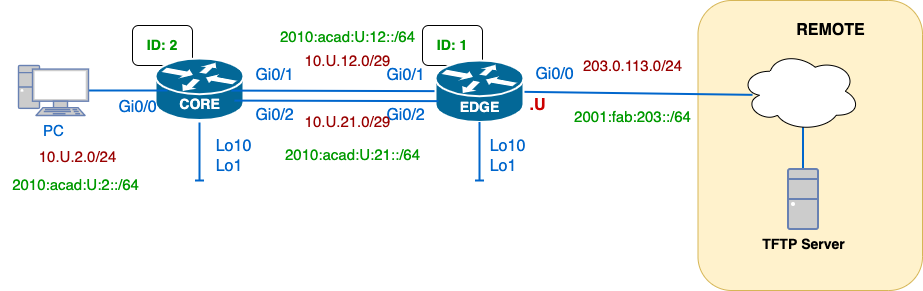

# Enterprise Routing Lab: Dual-Stack OSPF, Tuning & Failover

## Overview

A small enterprise topology built to practice dual-stack (IPv4/IPv6) addressing, OSPFv2 configuration and tuning, and route redundancy using both dynamic (OSPF) and static (floating route) failover mechanisms.

**Key Objectives:**
- Implement dual-stack IPv4/IPv6 addressing across all devices
- Configure and tune OSPFv2 for dynamic IPv4 routing
- Implement IPv6 static routing with floating backup routes
- Validate failover behavior for both IPv4 and IPv6
- Secure remote access with SSH and local authentication

---

## Topology

```
PC → CORE → (dual redundant links) → EDGE → WAN cloud → TFTP server
```



### Addressing Scheme

**Convention:** Last octet of every CORE interface is `2` (its device ID); every EDGE interface is `1`. `U` = student ID (13 in this lab).

| Device | Interface | IPv4 | IPv6 |
| :----- | :-------- | :--- | :--- |
| PC | NIC | 10.13.2.10/24* | 2010:ACAD:13:2::10/64* |
| CORE | Gi0/0 (to PC) | 10.13.2.2/24 | 2010:ACAD:13:2::2/64 |
| CORE | Gi0/1 (to EDGE, Link 1) | 10.13.12.2/29 | 2010:ACAD:13:12::2/64 |
| CORE | Gi0/2 (to EDGE, Link 2) | 10.13.21.2/29 | 2010:ACAD:13:21::2/64 |
| CORE | Lo10 (Router ID source) | 10.13.100.2/32* | — |
| EDGE | Gi0/1 (to CORE, Link 1) | 10.13.12.1/29 | 2010:ACAD:13:12::1/64 |
| EDGE | Gi0/2 (to CORE, Link 2) | 10.13.21.1/29 | 2010:ACAD:13:21::1/64 |
| EDGE | Gi0/0 (to WAN) | 203.0.113.13/24 | 2001:FAB:203::13/64 |
| EDGE | Lo10 (Router ID source) | 10.13.100.1/32* | — |

*Not specified on the original diagram; assigned consistent with the ID convention above.*

---

## Skills Demonstrated

| Category | Skills |
| :------- | :----- |
| **Addressing** | Dual-stack IPv4/IPv6 interface configuration |
| **Routing (IPv4)** | OSPFv2 configuration, manual router-ID assignment, route propagation, `default-information originate` |
| **OSPF Tuning** | Passive interfaces, reference bandwidth, cost manipulation, timer/priority tuning |
| **Routing (IPv6)** | Static routes, floating (backup) routes with administrative distance |
| **Redundancy** | IPv4 failover via dynamic OSPF reconvergence; IPv6 failover via floating static routes |
| **Security** | SSH hardening (local auth, RSA keys, no Telnet) |
| **Operations** | Configuration backup via TFTP, show command redirection |

---

## Implementation Steps

### 1. Base Configuration

#### Global Settings

```
hostname CORE
ipv6 unicast-routing
no ip domain-lookup
enable secret <strong-password>
```

**Note:** `ipv6 unicast-routing` is required globally—IPv6 forwarding is off by default even with addresses configured.

#### Interface Configuration

```
interface GigabitEthernet0/1
 description Link to EDGE (Primary)
 ip address 10.13.12.2 255.255.255.248
 ipv6 address 2010:ACAD:13:12::2/64
 no shutdown
```

Repeat per interface with matching description, IPv4, and IPv6 address from the addressing table above.

#### SSH Hardening (Local Auth, No Telnet)

```
ip domain-name lab.local
username admin secret cisco
crypto key generate rsa modulus 2048
ip ssh version 2
line vty 0 4
 transport input ssh
 login local
```

> **Security Note:** `cisco` as a password is lab-only and should never be used in production. Replace with a strong password for any deployment beyond a test bench.

#### Verification Commands

| Command | Purpose |
| :------ | :------ |
| `ping <ip-address>` | Test IPv4 connectivity |
| `ping ipv6 <ipv6-address>` | Test IPv6 connectivity |
| `show ip interface brief` | Verify IPv4 interface status |
| `show ipv6 interface brief` | Verify IPv6 interface status |

---

### 2. OSPFv2 (IPv4 Dynamic Routing)

#### Enable OSPF on CORE

```
router ospf 1
 router-id 10.13.100.2
 default-information originate
 passive-interface GigabitEthernet0/0
```

#### Enable OSPF on Participating Interfaces

```
interface GigabitEthernet0/1
 ip ospf 1 area 0
```

Enable on every interface **except** EDGE's WAN-facing Gi0/0—that link leads outside the routing domain and gets a default route instead.

#### Default Route on EDGE

```
ip route 0.0.0.0 0.0.0.0 203.0.113.1
```

> **Critical:** `default-information originate` under the OSPF process is required to propagate this static default into the OSPF domain. Without it, the route stays local to EDGE and downstream routers won't learn it.

#### Verification Commands

| Command | Purpose |
| :------ | :------ |
| `show ip ospf neighbor` | Verify OSPF adjacencies |
| `show ip protocols` | Check OSPF process configuration |
| `show ip route ospf` | View OSPF-learned routes |

---

### 3. OSPF Tuning

Both tuning changes applied consistently across CORE and EDGE.

#### Reference Bandwidth

**Problem:** Default reference bandwidth (100 Mbps) makes every Gigabit+ link cost the same (1). This prevents OSPF from distinguishing between different speed links.

**Fix:**
```
router ospf 1
 auto-cost reference-bandwidth 10000
```

#### Cost Manipulation (Path Preference)

**Goal:** Favor Link 1 (Gi0/1) over Link 2 (Gi0/2).

```
interface GigabitEthernet0/1
 ip ospf cost 10

interface GigabitEthernet0/2
 ip ospf cost 20
```

Lower cost wins. Set on both routers' matching interfaces so the preference is symmetric.

#### Additional Tuning Parameters (For Reference)

| Parameter | Command | Purpose |
| :-------- | :------ | :------ |
| DR/BDR Election | `ip ospf priority` | Controls router priority on multi-access segments |
| Hello Interval | `ip ospf hello-interval` | Must match on both ends of a link or adjacency drops |
| Dead Interval | `ip ospf dead-interval` | Must match on both ends; 4× hello interval by default |

> **Note:** Timer mismatches kill OSPF adjacencies outright. Cost/priority mismatches just cause suboptimal (but working) paths. Different failure modes—worth testing both deliberately.

#### Verification Commands

| Command | Purpose |
| :------ | :------ |
| `show ip ospf` | View OSPF process details and timers |
| `show ip route` | Verify route costs and path selection |
| `debug ip ospf adj` | Debug adjacency formation (use sparingly) |

---

### 4. IPv4 Failover Verification

#### Step 1: Establish Baseline

```
traceroute 203.0.113.13
```

Traffic should take the **lower-cost path** (Link 1 via Gi0/1 with cost 10).

#### Step 2: Simulate Failure

```
interface GigabitEthernet0/1
 shutdown
```

#### Step 3: Verify Convergence

Wait for OSPF to reconverge, then re-run:
```
traceroute 203.0.113.13
```

Traffic should now take **Link 2** (Gi0/2 with cost 20). The path cost increases but connectivity is maintained.

#### Step 4: Restore

```
interface GigabitEthernet0/1
 no shutdown
```

Traffic returns to the preferred lower-cost path automatically.

---

### 5. IPv6 Static & Floating Routes

**Design Decision:** IPv6 reachability is static rather than OSPF-driven—a deliberate contrast to the dynamic IPv4 setup above, demonstrating both approaches in a single lab.

#### Primary and Backup Routes on CORE

```
ipv6 route 2001:FAB:203::/64 2010:ACAD:13:12::1
ipv6 route 2001:FAB:203::/64 2010:ACAD:13:21::1 130
```

| Route | Next-Hop | AD | Role |
| :---- | :------- | :- | :--- |
| Line 1 | EDGE Gi0/1 (Link 1) | 1 (default) | Primary path |
| Line 2 | EDGE Gi0/2 (Link 2) | 130 | Floating backup (hidden until needed) |

The floating route stays out of the routing table entirely unless the primary route's next-hop becomes unreachable.

#### Alternative: Link-Local Next-Hops

Link-local next-hops require the exit interface to be specified (since an LLA isn't globally unique):

```
ipv6 route 2001:FAB:203::/64 GigabitEthernet0/1 FE80::1
```

> **Note:** Actual link-local addresses are auto-generated, not assigned by the ID convention.

#### Verification Commands

| Command | Purpose |
| :------ | :------ |
| `show ipv6 route` | Verify IPv6 routing table |
| `ping ipv6 <ipv6-address>` | Test IPv6 connectivity |
| `traceroute <ipv6-address>` | Verify path selection |

---

### 6. IPv6 Failover Verification

#### Step 1: Establish Baseline

```
traceroute 2001:FAB:203::13
```

Traffic should take **Link 1** (primary static route).

#### Step 2: Simulate Failure

```
interface GigabitEthernet0/1
 shutdown
```

#### Step 3: Verify Convergence

Re-run the traceroute. Traffic should now take **Link 2** via the floating route with AD 130.

The failover is **not instantaneous**—the router detects that the primary next-hop is unreachable and installs the backup route.

#### Step 4: Restore

```
interface GigabitEthernet0/1
 no shutdown
```

Traffic returns to the primary route.

---

### 7. Configuration Backup

#### Manual Backup via TFTP

```
copy running-config tftp:
```

Prompts for TFTP server IP and filename.

#### Redirect Show Command Output

```
show ip route | redirect tftp://<tftp-ip>/core-route-table.txt
```

This captures show command output directly to a file on the TFTP server without leaving the terminal.

---

## Key Takeaways

| Concept | Lesson |
| :------ | :----- |
| **default-information originate** | Easy to forget; its absence is invisible until you check a downstream router's routing table |
| **Reference Bandwidth** | Only matters once your fastest links get cheap enough to look identical to OSPF's default math |
| **Interface Cost** | Lower cost = preferred path; symmetric cost settings ensure consistent behavior |
| **Floating Static Routes** | Clean, protocol-independent redundancy for smaller networks |
| **Timer vs. Cost Mismatches** | Timer mismatches kill adjacencies; cost mismatches just cause suboptimal (but working) paths |
| **Dual-Stack Practice** | Demonstrates both dynamic (IPv4 OSPF) and static (IPv6) routing in the same lab |

---

## Troubleshooting Reference

| Issue | Likely Cause | Fix |
| :---- | :----------- | :-- |
| OSPF neighbor not forming | Hello/dead timer mismatch | Match timers on both ends |
| Route not in routing table | Area mismatch or passive interface | Check area config; remove passive if needed |
| Default route missing on CORE | `default-information originate` missing | Add under OSPF process |
| IPv6 failover not working | Primary route still in routing table | Check next-hop reachability; AD 130 may not be high enough if primary AD > 130 |
| Backup route not installing | Primary route still considered valid | Primary route's next-hop must be completely unreachable |

---

## Lab Completion Checklist

- [ ] IPv4/IPv6 addressing configured on all interfaces
- [ ] SSH enabled, Telnet disabled
- [ ] OSPFv2 configured with router ID
- [ ] OSPF neighbors established
- [ ] Default route propagated via OSPF
- [ ] Reference bandwidth tuned (10000 Mbps)
- [ ] Interface costs set (Link 1: 10, Link 2: 20)
- [ ] IPv4 failover tested and working
- [ ] IPv6 static primary route configured
- [ ] IPv6 floating backup route configured (AD 130)
- [ ] IPv6 failover tested and working
- [ ] Configuration backed up to TFTP server

---

**Environment:** [GNS3 / EVE-NG / Physical Hardware]

---
