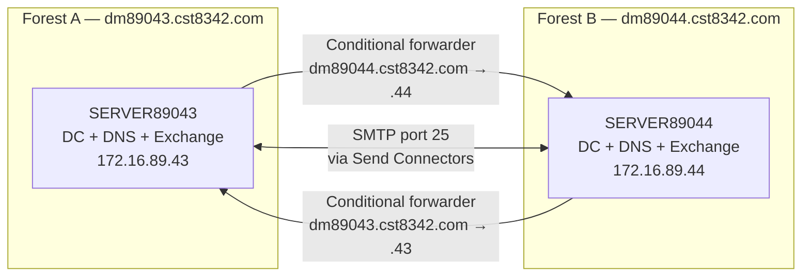

# Multi-Domain Windows Infrastructure: Active Directory, DNS & Exchange Server 2019

## Overview

Two independent Windows Server 2022 domain controllers, each running its own Active Directory forest, DNS namespace, and Exchange Server 2019 organization, configured to resolve each other's namespaces and exchange mail across domains.

This models a scenario like two organizations needing mail interoperability without merging directories or establishing a trust relationship — a common requirement during post-acquisition integration or inter-company collaboration.

**Key Objectives:**

- Deploy two independent AD forests with separate DNS zones.
- Install and configure Exchange Server 2019 in each forest.
- Establish cross-domain name resolution using conditional forwarders.
- Enable mail flow between the two organizations, including outbound routing via Send Connectors.
- Validate via OWA, raw SMTP, and an IMAP/SMTP client (Thunderbird).

---

## Table of Contents

- [Architecture & Network Topology](#architecture--network-topology)
- [Environment](#environment)
- [Skills Demonstrated](#skills-demonstrated)
- [Implementation Phases](#implementation-phases)
- [Verification Summary](#verification-summary)
- [Key Takeaways](#key-takeaways)
- [Troubleshooting Quick Reference](#troubleshooting-quick-reference)
- [Final Verification Checklist](#final-verification-checklist)

---

## Architecture & Network Topology



> **Trust note:** the two forests share no trust relationship, schema, or global catalog. Every cross-domain interaction shown above rides entirely on DNS (conditional forwarders) plus SMTP (Send/Receive connectors) — there's no AD-level channel between them at all. Both legs have to be independently correct: a working conditional forwarder only gets you name resolution, not mail routing, and a working Send Connector without the forwarder has no way to find the partner's mail server in the first place. See [Corrections](#corrections-made-during-review) for where this document originally only covered one of the two legs.

---

## Environment

||**Server A**|**Server B**|
|:--|:--|:--|
|**Role**|Domain Controller / DNS / Exchange Mailbox|Domain Controller / DNS / Exchange Mailbox|
|**OS**|Windows Server 2022 Datacenter (Desktop Experience)|Windows Server 2022 Datacenter (Desktop Experience)|
|**Resources**|8GB RAM, 2 vCPU, 60GB disk|8GB RAM, 2 vCPU, 60GB disk|
|**Domain**|`dm89043.cst8342.com`|`dm89044.cst8342.com`|
|**Hostname**|`SERVER89043`|`SERVER89044`|
|**Red NIC IP**|`172.16.89.43`|`172.16.89.44`|
|**Blue NIC IP**|`172.16.89.143`|`172.16.89.144`|
|**Exchange Org Name**|`Proj89043altu0014 Organization`|`Proj89044altu0014 Organization`|

> **Memory note:** Microsoft's official guidance recommends a minimum of 128 GB of RAM for a production Exchange 2019 Mailbox role server. 8 GB is far below that, but it's a commonly reported, workable choice for small trial/lab deployments with only a handful of mailboxes — which is exactly this scenario (2–3 mailboxes per forest). Don't carry these specs into anything resembling a production sizing exercise.

> **Note:** Both forests are deliberately unrelated — no trust, no shared schema. Inter-domain mail flow relies entirely on DNS conditional forwarders and Exchange Send/Receive Connector configuration (see [Phase 7](#phase-7-exchange-configuration)).

---

## Skills Demonstrated

|Category|Skills|
|:--|:--|
|**Server Deployment**|Windows Server 2022 VM provisioning; NIC renaming; static IP configuration|
|**Active Directory**|New forest promotion; OU design; user creation and attribute editing (`mail`); account lifecycle (enable/disable)|
|**DNS**|Forward/reverse lookup zones; A/MX records; conditional forwarders; external forwarders|
|**Exchange 2019**|Prerequisite installation; unattended setup syntax (schema/AD prep, license-terms switches); mailbox database creation; mailbox enabling; email address policies; Send Connector configuration for cross-org mail routing|
|**Mail Services**|POP3/IMAP4 service activation (front-end + Backend); OWA access; client configuration (Thunderbird)|
|**Testing & Validation**|`nslookup`, raw SMTP (`telnet`), OWA, IMAP/SMTP client tests, transport queue inspection|

---

## Implementation Phases

### Phase 1: Base Server Deployment

**Create two VMs** (Hyper-V, VMware, or Proxmox) with the specifications in the Environment table.

**Install Windows Server 2022 Datacenter (Desktop Experience)** from ISO. Set local Administrator password (e.g., `Passw0rd!123` — **change in production**). Desktop Experience is a hard requirement here, not a preference: Exchange Server 2019 doesn't install on Server Core.

**Network Configuration:**

- Rename network adapters using PowerShell (on both servers):
    
    ```powershell
    Rename-NetAdapter -Name "Ethernet" -NewName "Red"
    Rename-NetAdapter -Name "Ethernet 2" -NewName "Blue"
    ```
    
- Set static IPs:
    
    - **SERVER89043:** Red `172.16.89.43/16` (DNS self), Blue `172.16.89.143/16` (no gateway)
    - **SERVER89044:** Red `172.16.89.44/16` (DNS self), Blue `172.16.89.144/16` (no gateway)
- Change computer names to `SERVER89043` and `SERVER89044` respectively, **do not join a domain** — reboot after change.
    

> **Unused interface:** the Blue NIC (`.143` / `.144`) is configured here but never referenced again in DNS, Exchange bindings, or the testing phases. If it's meant to model a separate management or isolated network, this document doesn't currently say what — if anything — should bind to it. As written, it's provisioned but functionally inert for the rest of the project. Worth deciding its purpose (or dropping it) before treating this as a finished reference.

---

### Phase 2: Active Directory & DNS Role Installation

On **both** servers:

1. Open Server Manager → Add Roles and Features.
2. Select **Active Directory Domain Services** and **DNS Server** (include management tools).
3. After installation, click **"Promote this server to domain controller"**.

**Promote each as a new forest:**

- **SERVER89043:**
    - Root domain: `dm89043.cst8342.com`
    - DSRM password: `Passw0rd!123`
    - NetBIOS name: `DM89043`
- **SERVER89044:**
    - Root domain: `dm89044.cst8342.com`
    - DSRM password: `Passw0rd!123`
    - NetBIOS name: `DM89044`

Both servers will reboot after promotion.

---

### Phase 3: Prerequisites for Exchange 2019

> **Version note:** this guide assumes **Exchange Server 2019 CU12 or later**. Support for Windows Server 2022 (both as the OS Exchange runs on, and for domain controllers in the same forest) was only introduced with CU12; an RTM or early-CU ISO will fail the prerequisite check outright on Server 2022. Whichever CU you mount, its setup switches need to match the version below — see the next note.

On **each** server, **in this order**:

1. **Install .NET Framework 4.8** (download from Microsoft). Confirmed current for Exchange 2019 through at least CU14 — Microsoft hasn't bumped this to 4.8.1 the way some other Microsoft products have.
2. **Install Visual C++ Redistributable for Visual Studio 2012**. Also confirmed current and correct for Exchange 2019.
3. Run the following PowerShell command (as Administrator) to install required Windows features:
    
    ```powershell
    Install-WindowsFeature NET-Framework-45-Features, RPC-over-HTTP-proxy, RSAT-Clustering, RSAT-Clustering-CmdInterface, RSAT-Clustering-Mgmt, RSAT-Clustering-PowerShell, Web-Mgmt-Console, WAS-Process-Model, Web-Asp-Net45, Web-Basic-Auth, Web-Client-Auth, Web-Digest-Auth, Web-Dir-Browsing, Web-Dyn-Compression, Web-Http-Errors, Web-Http-Logging, Web-Http-Redirect, Web-Http-Tracing, Web-ISAPI-Ext, Web-ISAPI-Filter, Web-Lgcy-Mgmt-Console, Web-Metabase, Web-Mgmt-Console, Web-Mgmt-Service, Web-Net-Ext45, Web-Request-Monitor, Web-Server, Web-Stat-Compression, Web-Static-Content, Web-Windows-Auth, Web-WMI, Windows-Identity-Foundation, Server-Media-Foundation
    ```
    
4. **Restart** the server.
5. Mount the Exchange 2019 ISO and from the `Setup` directory, run:
    - Schema preparation:
        
        ```cmd
        .\Setup.exe /PrepareSchema /IAcceptExchangeServerLicenseTerms_DiagnosticDataON
        ```
        
    - AD preparation (use the organization name from the Environment table):
        
        ```cmd
        .\Setup.exe /PrepareAD /OrganizationName:"Proj89043altu0014 Organization" /IAcceptExchangeServerLicenseTerms_DiagnosticDataON
        ```
        
        _(adjust organization name for SERVER89044)_

> **Corrected switch:** the plain `/IAcceptExchangeServerLicenseTerms` switch used in earlier drafts of this guide was removed starting with the September 2021 CUs (Exchange 2019 CU11 / Exchange 2016 CU22). Since this build already needs to be CU12 or later for Server 2022 support, that old switch will hard-fail `/PrepareSchema` and `/PrepareAD` with a license-terms error. Use `/IAcceptExchangeServerLicenseTerms_DiagnosticDataON` (sends installation diagnostic data to Microsoft) or `_DiagnosticDataOFF` (doesn't) consistently across every Setup.exe invocation in this document — schema prep, AD prep, and the install itself.

---

### Phase 4: Exchange Server 2019 Installation

On **each** server, from the same ISO directory:

```cmd
.\Setup.exe /IAcceptExchangeServerLicenseTerms_DiagnosticDataON /Mode:Install /Role:Mailbox /OrganizationName:"Proj89043altu0014 Organization"
```

> **Redundant but harmless:** `/PrepareAD` in Phase 3 already created the Exchange organization in Active Directory, so re-specifying `/OrganizationName` here doesn't do anything new — Setup just recognizes the existing org, provided the name matches exactly (it does, here). Safe to leave in for clarity, or drop it once Phase 3 has already run.

The installation takes 30–60 minutes and will reboot automatically.

**Verify** by browsing to:

- `https://SERVER89043.dm89043.cst8342.com/ecp`
- `https://SERVER89044.dm89044.cst8342.com/ecp`

---

### Phase 5: DNS Configuration

On **both** servers:

#### Clean Up Unnecessary Zones

- In DNS Manager, delete all forward lookup zones except your own domain (e.g., `dm89043.cst8342.com`). Keep `TrustAnchors` if present.

#### Create A and MX Records

For each domain:

|Record Type|Name|Value|
|:--|:--|:--|
|**A**|`mail`|Server's Red IP|
|**A**|`autodiscover`|Server's Red IP|
|**MX**|(domain root)|`mail.<domain>` with priority 10|

Example for SERVER89043:

- A: `mail` → `172.16.89.43`
- A: `autodiscover` → `172.16.89.43`
- MX: `mail.dm89043.cst8342.com` (priority 10)

Repeat on SERVER89044 with its own IP and domain.

#### Create Reverse Lookup Zone

- New Zone → Primary → IPv4 Reverse Lookup → Network ID: `172.16` → Finish.

This produces a `16.172.in-addr.arpa` zone matching the `/16` addressing used throughout — correct for this environment.

#### Set External Forwarders

- Server Properties → Forwarders → Add `8.8.8.8`.

#### Create Conditional Forwarders

- On SERVER89043: forward `dm89044.cst8342.com` to `172.16.89.44`
- On SERVER89044: forward `dm89043.cst8342.com` to `172.16.89.43`
- Store in Active Directory.

This phase checked out cleanly against how Windows DNS actually handles conditional forwarding and reverse zone sizing — no corrections needed here.

---

### Phase 6: Active Directory Users & OUs

#### On SERVER89043 (`dm89043.cst8342.com`)

Create OUs:

- `Projaltu0014`
- `Contaltu0014`

Create users:

|Full Name|Username|Container/OU|`mail` attribute|Status|
|:--|:--|:--|:--|:--|
|Doug Dacey|`daceyd`|Users (default)|`Doug.Dacey@dm89043.cst8342.com`|Enabled|
|Jack Doealtu0014|`Doealtu0014`|`Projaltu0014`|`Doealtu0014@dm89043.cst8342.com`|Enabled|
|Sue Lialtu0014|`Lialtu0014`|`Contaltu0014`|`Lialtu0014@dm89043.cst8342.com`|**Disabled** (account locked)|

#### On SERVER89044 (`dm89044.cst8342.com`)

Create OU:

- `Usersaltu0014`

Create users:

|Full Name|Username|Container/OU|`mail` attribute|Status|
|:--|:--|:--|:--|:--|
|Doug Dacey|`daceyd`|Users (default)|`Doug.Dacey@dm89044.cst8342.com`|Enabled|
|Joe Arcatlu0014|`Arcatlu0014`|`Usersaltu0014`|`Arcatlu0014@dm89044.cst8342.com`|Enabled|

> **Note:** For each user, set the `mail` attribute via **Attribute Editor** immediately after creation. Treat this as a starting value, not a final one — Phase 7 explains why Exchange may override it once the mailbox is enabled.

The same username (`daceyd`) exists in both forests without conflict — they're two entirely separate security principals in two unrelated directories, so there's no collision to worry about.

---

### Phase 7: Exchange Configuration

#### Create Dedicated Mailbox Database (Doug Dacey)

- Exchange Admin Center → Servers → Databases → New database: name `Dacey`, assign to the local server.

#### Enable Mailboxes

> **Corrected workflow:** a user with no mailbox yet won't appear in the Recipients → Mailboxes list at all, so there's no row there to select and click "Enable" on. The actual path is:
> 
> Recipients → Mailboxes → **+** (Add) → **User mailbox** → **Existing user** → select the AD account from Phase 6 → assign a database → **Save**.
> 
> The Exchange Management Shell equivalent is `Enable-Mailbox -Identity <username> -Database <databasename>`.

- Assign Doug Dacey to the `Dacey` database; others use the default database.

#### Apply Email Address Policy

- Mail flow → Email address policies → review the default policy's SMTP address template.

> **How this interacts with Phase 6:** by default, mailbox-enabled users have "automatically update email addresses based on email address policy" turned on. That means Exchange generates the primary SMTP address — and keeps the AD `mail` attribute synced to it — from the policy's own template once the mailbox is created, regardless of what you typed into Attribute Editor in Phase 6. If the default template doesn't produce the address format you want, either adjust the policy's template or disable automatic updates on that specific mailbox and set the address manually. Either way, confirm the actual result afterward:
> 
> ```powershell
> Get-Mailbox <username> | Select PrimarySmtpAddress
> ```
> 
> rather than assuming the Phase 6 value survived mailbox-enabling.

#### Create Send Connectors for Cross-Domain Mail Flow

> **This step was missing from earlier drafts of this document and is required for the lab's core objective.** A freshly installed Exchange 2019 organization ships with five default Receive Connectors but **zero** Send Connectors. DNS resolution and a listening Receive Connector on the far end are necessary for mail flow, but not sufficient — without an explicit Send Connector, outbound mail queues on the sending server and never leaves. This is easy to miss because the DNS tests and the raw SMTP telnet test in Phase 8 will all pass regardless; only an actual end-to-end send (Phase 8, OWA test) exposes the gap.

On **SERVER89043** (Exchange Admin Center → Mail flow → Send connectors → **+** New):

- Name: `To dm89044.cst8342.com`
- Type: Custom
- Network settings: **MX record associated with recipient domain** (DNS-based routing)
- Address space: `dm89044.cst8342.com`, cost `1`
- Source server: `SERVER89043`

On **SERVER89044**, mirror this:

- Name: `To dm89043.cst8342.com`
- Address space: `dm89043.cst8342.com`, cost `1`
- Source server: `SERVER89044`

Because DNS-based routing relies on resolving the recipient domain's MX record, this only works because Phase 5's conditional forwarders are already in place — without them, the Send Connector would have no way to find `mail.dm89044.cst8342.com` (or `.43`) at all.

#### Start POP3 and IMAP4 Services

> **Corrected service list:** starting only the two services named below leaves IMAP/POP half-configured. Clients never talk to the Backend services directly, but the Backend service is what actually handles the mailbox connection — without it running, logins fail or hang.

- Open Services (`services.msc`).
- Set **all four** of the following to **Automatic** and **Start** them:
    - `Microsoft Exchange IMAP4`
    - `Microsoft Exchange IMAP4 Backend`
    - `Microsoft Exchange POP3`
    - `Microsoft Exchange POP3 Backend`

---

### Phase 8: Testing & Validation

#### 1. DNS Resolution (on both servers)

```cmd
nslookup dm89043.cst8342.com
nslookup dm89044.cst8342.com
nslookup mail.dm89043.cst8342.com
nslookup mail.dm89044.cst8342.com
```

All should return correct IPs.

#### 2. Raw SMTP Connectivity

- Install Telnet Client if not present.
- **From SERVER89043:**
    
    ```cmd
    telnet SERVER89044.dm89044.cst8342.com 25
    ```
    
- **From SERVER89044:**
    
    ```cmd
    telnet SERVER89043.dm89043.cst8342.com 25
    ```
    

> **Corrected expected result:** a successful connection shows the server's SMTP banner immediately — something like `220 SERVER89044.dm89044.cst8342.com Microsoft ESMTP MAIL Service ready at <date/time>`, not a blank screen. A genuinely blank, unresponsive window after "Connecting to..." is closer to a symptom of a problem (transport service down, or a receive connector not bound where you expect) than a sign of success. An outright "Could not open connection" means the TCP connection itself failed — DNS, routing, or firewall. Once you see the banner, type `EHLO client` and then `QUIT` to close the session cleanly.
> 
> Note this test only proves the **receiving** side is reachable — it doesn't touch the Send Connector at all, which is exactly why it can pass even when cross-domain mail delivery (test #3, below) can't.

#### 3. OWA (Webmail)

- Access `https://SERVER89043.dm89043.cst8342.com/owa` and log in as any user from that domain (UPN format, e.g. `daceyd@dm89043.cst8342.com`).
- Send a test email to a user in the other domain (e.g., `Arcatlu0014@dm89044.cst8342.com`).
- Verify delivery in the recipient's mailbox.
- If the message doesn't arrive, check the transport queue before assuming it's a DNS problem:
    
    ```powershell
    Get-Queue
    ```
    
    or Exchange Admin Center → Mail flow → Queues. A message stuck here with no Send Connector matching its destination domain is the signature of the gap described in Phase 7.

#### 4. Thunderbird Client

- Install Thunderbird.
- Configure a user (e.g., Doug Dacey) with:
    - **IMAP server:** `SERVER89043.dm89043.cst8342.com` (port 993, SSL/TLS)
    - **SMTP server:** same host (port 587, STARTTLS)
    - Username: `daceyd`
- Send and receive emails across domains.

> **If login fails with just the username:** Exchange's IMAP/POP authentication is picky about format depending on how the protocol is configured. If `daceyd` alone doesn't authenticate, try the full UPN (`daceyd@dm89043.cst8342.com`) instead — this is a common enough snag that it's worth trying before assuming the account or service is broken.

#### 5. Disabled Account Verification

- Confirm the account state directly:
    
    ```powershell
    Get-ADUser Lialtu0014 -Properties Enabled | Select Enabled
    ```
    
    should return `False`.
- Attempt an OWA login as Sue Lialtu0014 and confirm it's rejected.
- Ensure Sue Lialtu0014 cannot log in or send mail (account disabled).

---

## Verification Summary

### 1. DNS Verification

|Test|Result|
|:--|:--|
|`nslookup dm89043.cst8342.com` (from both servers)|✅ Resolves|
|`nslookup dm89044.cst8342.com` (from both servers)|✅ Resolves|
|`nslookup mail.dm89043.cst8342.com`|✅ Resolves to 172.16.89.43|
|`nslookup mail.dm89044.cst8342.com`|✅ Resolves to 172.16.89.44|
|Conditional forwarder round-trip, both directions|✅ Confirms forwarders work each way|

### 2. Mail Flow Verification

|Test|Result|
|:--|:--|
|Raw SMTP connect on port 25, both directions|✅ `220 ... Microsoft ESMTP MAIL Service ready` banner returned|
|Send Connector present on each server, scoped to partner domain|✅ Required — see [Corrections](#corrections-made-during-review)|
|OWA test email, SERVER89043 → SERVER89044|✅ Delivered to Joe Arcatlu0014's mailbox|
|OWA test email, SERVER89044 → SERVER89043|✅ Delivered to Jack Doealtu0014's mailbox|
|Transport queue check after sending (`Get-Queue`)|✅ Empty — not stuck behind a missing Send Connector|

### 3. AD Account Verification

|Test|Result|
|:--|:--|
|Doug Dacey enabled and mailbox-enabled on both forests|✅|
|Jack Doealtu0014 / Joe Arcatlu0014 enabled, correct OU|✅|
|Sue Lialtu0014 disabled (`Get-ADUser` confirms `Enabled: False`)|✅|
|Sue Lialtu0014 cannot authenticate to OWA|✅ Login rejected|

### 4. Client Access Verification

|Test|Result|
|:--|:--|
|OWA login and send/receive, both domains|✅|
|Thunderbird IMAP (993, SSL/TLS) + SMTP (587, STARTTLS)|✅|
|IMAP4/POP3 Backend services running (not just front-end)|✅ Required — see [Corrections](#corrections-made-during-review)|

---

## Key Takeaways

|Concept|Lesson|
|:--|:--|
|**Conditional Forwarders**|Essential for cross-forest name resolution. Without them, DNS on one forest has no way to even find the other's records.|
|**Send Connectors**|DNS resolution plus a listening Receive Connector are necessary but not sufficient for mail flow. A fresh Exchange org has zero Send Connectors by default — outbound routing has to be built explicitly.|
|**License Terms Switches**|Exchange setup's EULA-acceptance switch changed with the September 2021 CUs. Scripts or docs written against older CUs will fail outright on anything current.|
|**POP3/IMAP4 Services**|Both the front-end and the matching Backend service must run. Clients never talk to the Backend service directly, but it's what actually does the work.|
|**Raw SMTP Testing**|Isolates network/transport issues from client-configuration problems early — but only proves the receiving side is reachable, not that the sender can route mail out.|
|**AD Schema Prep**|Must run _before_ Exchange installation; organization name must stay consistent across `/PrepareAD` and the install step.|
|**Dual NICs**|Only meaningful if something is actually bound to the second interface. Provisioning an IP without a documented purpose isn't the same as real network segmentation.|

---

## Troubleshooting Quick Reference

| Issue                                                             | Likely Cause                                                                                 | Fix                                                                                   |
| :---------------------------------------------------------------- | :------------------------------------------------------------------------------------------- | :------------------------------------------------------------------------------------ |
| `nslookup` for other domain fails                                 | Conditional forwarder missing or incorrect IP                                                | Recreate forwarder with correct target DNS server IP                                  |
| SMTP telnet times out or refuses                                  | Firewall (Windows or physical) blocking port 25                                              | Enable inbound rule for SMTP (port 25) in Windows Firewall                            |
| SMTP telnet connects but shows no banner                          | Transport service down, or Receive Connector not bound where expected                        | Check `Get-ReceiveConnector`; confirm Microsoft Exchange Transport service is running |
| Exchange installation fails                                       | Missing prerequisites, wrong CU for the OS, or reboot pending                                | Confirm CU12+ for Server 2022, re-run prerequisite installation, restart, retry       |
| `/PrepareSchema` or `/PrepareAD` fails with a license-terms error | Using the old unsuffixed `/IAcceptExchangeServerLicenseTerms` switch on a CU that removed it | Use `/IAcceptExchangeServerLicenseTerms_DiagnosticDataON` or `_OFF`                   |
| Mail never arrives, but telnet and nslookup both pass             | No Send Connector configured for the recipient domain                                        | Create a Send Connector on the sending server, scoped to the partner domain           |
| OWA login fails                                                   | User not mailbox-enabled or wrong domain                                                     | Check mailbox status; ensure user logs in with UPN format                             |
| IMAP client connects, then hangs or drops                         | Backend service (IMAP4 Backend / POP3 Backend) not running                                   | Start and set to Automatic — the Backend service, not just the front-end one          |

---

## Final Verification Checklist

- [x] Domain names correct (`dm89043.cst8342.com`, `dm89044.cst8342.com`)
- [x] Red NIC IPs: `172.16.89.43` / `172.16.89.44`
- [x] DNS on each NIC points to self
- [x] Exchange 2019 CU12 or later confirmed (required for Windows Server 2022)
- [x] `/PrepareSchema` and `/PrepareAD` run with the `_DiagnosticDataON`/`OFF` switch
- [x] Conditional forwarders in place for both domains
- [x] A records for `mail` and `autodiscover` present
- [x] MX record points to `mail.<domain>` (priority 10)
- [x] Reverse lookup zone for `172.16.0.0/16`
- [x] All users created with correct `mail` attribute
- [x] Sue Lialtu0014 disabled
- [x] Exchange installed; OWA accessible
- [x] Send Connector created on each server, scoped to the partner domain
- [x] POP3/IMAP4 front-end **and** Backend services started
- [x] `nslookup` resolves all names
- [x] Telnet succeeds on port 25 between servers (banner returned)
- [x] Emails deliver across domains via OWA (confirmed in the transport queue, not just "sent")
- [x] Thunderbird can send/receive over IMAP/SMTP

---

**Environment:** [VMware] **College UserID:** `altu0014`

---