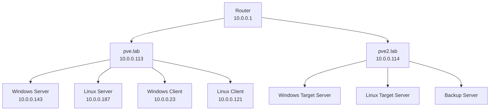

# Homelab Proxmox Cluster: Two-Node Virtualization, Backup & Tailscale Networking

## Overview

This project began with two spare SFF PCs and the requirement to host multiple virtualized environments as flexibly and cost-effectively as possible. The result is a two-node Proxmox cluster providing virtualization, backup, and network services for a home lab environment.

**Key Objectives:**
- Consolidate two spare SFF PCs into a two-node Proxmox VE cluster
- Host multiple virtualized environments — Windows, Linux, and security-focused VMs — flexibly and cost-effectively
- Provide virtualization, backup, and network services for the home lab
- Enable secure remote access to lab VMs via Tailscale subnet routing

---

## Table of Contents

- [Network Architecture](#network-architecture)
- [Skills Demonstrated](#skills-demonstrated)
- [Implementation Steps](#implementation-steps)
- [Key Takeaways](#key-takeaways)
- [Troubleshooting Reference](#troubleshooting-reference)
- [Future Plans](#future-plans)

---

## Network Architecture

```
Router (10.0.0.1) → pve.lab / pve2.lab (Proxmox Cluster) → Guest VMs
```

```
┌───────────────────────────────────────────────────┐
│                    Router                         │
│                   10.0.0.1                        │
└──────────┬──────────────────┬─────────────────────┘
           │                  │
           ▼                  ▼
   ┌───────────────┐  ┌───────────────┐
   │  pve.lab      │  │  pve2.lab     │
   │  10.0.0.113   │  │  10.0.0.114   │
   │               │  │               │
   │  ┌─────────┐  │  │  ┌─────────┐  │
   │  │Windows  │  │  │  │Windows  │  │
   │  │Server   │  │  │  │Target   │  │
   │  10.0.0.143|  │  │  │         │  │
   │  └─────────┘  │  │  └─────────┘  │
   │  ┌─────────┐  │  │  ┌─────────┐  │
   │  │Linux    │  │  │  │Linux    │  │
   │  │Server   │  │  │  │Target   │  │
   │  10.0.0.187│  │  │  │         │  │
   │  └─────────┘  │  │  └─────────┘  │
   │  ┌─────────┐  │  │  ┌─────────┐  │
   │  │Windows  │  │  │  │Backup   │  │
   │  │Client   │  │  │  │Server   │  │
   │  │10.0.0.23│  │  │  │         │  │
   │  └─────────┘  │  │  └─────────┘  │
   │  ┌─────────┐  │  │               │
   │  │Linux    │  │  │               │
   │  │Client   │  │  │               │
   │  10.0.0.121│  │  │               │
   │  └─────────┘  │  │               │
   └───────────────┘  └───────────────┘
```

A text-native version, useful anywhere the diagram above doesn't render cleanly (e.g. viewing raw markdown):



### Hardware Inventory

| Node | Model | CPU | RAM | Storage | NICs |
| :--- | :---- | :-- | :-- | :------ | :--- |
| **pve.lab** | OptiPlex 7040 | Intel i7-6700 | 32 GB DDR4 | 1 TB SATA SSD | 1x Gigabit Ethernet |
| **pve2.lab** | Spare SFF | Intel i7-4770 | 32 GB DDR3 | 512 GB SSD | 1x Gigabit Ethernet |

---

## Skills Demonstrated

| Category | Skills |
| :------- | :----- |
| **Virtualization & Clustering** | Proxmox VE installation and configuration; multi-node cluster setup |
| **VM Provisioning** | Deployment of Windows and Linux guest VMs for varied workloads (AD labs, cybersecurity testing, general use) |
| **Networking** | Static IP configuration; Tailscale VPN and subnet routing; IP-forwarding troubleshooting |
| **Systems Administration** | Remote access configuration (RDP/SSH); ISO and image management |
| **Documentation** | Hardware inventory tracking; access-credential recordkeeping; lessons-learned capture |

---

## Implementation Steps

### 1. Node 1 (pve.lab) – Primary Deployment

#### Proxmox Installation

A USB flash drive was prepared with the Proxmox VE 9.4 installer and used to boot the system. The graphical installation was performed with these custom settings:

- Hostname: `pve.lab`
- IP address: `10.0.0.113`
- Default gateway: `10.0.0.1`

All other installation options were left at their defaults.

#### Physical Placement & Verification

The server was restarted and placed in its permanent location: the unfinished basement area, which is used for storage and houses the router.

**Connectivity Verification:**
```bash
ping 10.0.0.1
```

The Proxmox web interface was accessed at `http://10.0.0.113:8006` and a successful login was confirmed.

#### System Preparation

ISO files were uploaded to the Proxmox storage:
- Windows Server 2019
- Windows 10
- Ubuntu Server
- Ubuntu Desktop
- TrueNAS Scale

#### Virtual Machine Deployment

Four virtual machines were created via the Proxmox web interface:

| VM | OS | Purpose | Notes |
| :- | :- | :------ | :---- |
| Windows Server | Windows Server 2019 | RDP-enabled Windows server for AD labs and various Services | |
| Linux Server | Ubuntu Server | SSH-enabled Linux server running Tailscale Subnets and obsidian self hosted LiveSync | |
| Windows Client | Windows 10 | RDP-enabled client for AD labs and testing | |
| Linux Client | Ubuntu Desktop | SSH-enabled client for various testing and experiments | |
| Security Onion | Security Onion 16.04.6 | Closed box network security analysis and testing environment | This VM was apart of my education at Algonquin College. Migrated from VirtualBox. |
| CyberSecLabWorkstation | Ubuntu | Closed box general cybersecurity analysis and testing environment | This VM was apart of my education at Algonquin College. Migrated from VirtualBox. |
| Kali | Kali | Cybersecurity AttackerBox and TryHackMe access point | |

No major issues were encountered during deployment.

#### Tailscale Configuration

Tailscale was installed on the Linux server running within the Proxmox host. IP forwarding was not initially enabled, which prevented subnet advertisement. The following commands were executed to enable IP forwarding:

```bash
echo 'net.ipv4.ip_forward = 1' | sudo tee -a /etc/sysctl.d/99-tailscale.conf
echo 'net.ipv6.conf.all.forwarding = 1' | sudo tee -a /etc/sysctl.d/99-tailscale.conf
sudo sysctl -p /etc/sysctl.d/99-tailscale.conf
```

**Tailscale Hostname:** `zapus-kingsnake.ts.net`

> **Note:** IP forwarding is not enabled by default — it must be explicitly turned on for Tailscale subnet routing to work.

---

### 2. Node 2 (pve2.lab) – Secondary/Backup Deployment

#### Proxmox Installation

A USB flash drive was prepared with the Proxmox VE 9.4 installer and used to boot the system. The graphical installation was performed with these custom settings:

- Hostname: `pve2.lab`
- IP address: `10.0.0.114`
- Default gateway: `10.0.0.1`

All other installation options were left at their defaults.

#### Physical Placement & Verification

The server was restarted and placed in its permanent location alongside the primary node in the basement.

**Connectivity Verification:**
```bash
ping 10.0.0.1
```

The Proxmox web interface was accessed at `http://10.0.0.114:8006` and a successful login was confirmed.

#### Cluster Configuration

On the existing Proxmox node (pve.lab), a cluster named **PVE-CLUSTER** was created. The newly created node (pve2.lab) joined the environment to the cluster.

#### Planned Virtual Machines

As it stands, only three VMs are planned for this node:

| VM | Purpose |
| :- | :------ |
| Windows Target Server | Windows-based target for security testing |
| Linux Target Server | Linux-based target for security testing |
| Backup Server | Dedicated backup storage and management |

---

### 3. Access Configuration

| Service | Address / Method |
| :------ | :---------------- |
| Proxmox Web UI (pve) | `http://10.0.0.113:8006` |
| Proxmox Web UI (pve2) | `http://10.0.0.114:8006` |
| Windows Server | RDP `10.0.0.143:3389` |
| Linux Server | SSH `wayne@10.0.0.187` |
| Windows Client | RDP `10.0.0.23:3389` |
| Linux Client | SSH `wayne@10.0.0.121` |
| Tailscale Entry | `zapus-kingsnake.ts.net` |

_Note: Both Proxmox Web UI instances can be accessible from each other's address._

---

## Key Takeaways

| Concept | Lesson |
| :------ | :----- |
| **IP Forwarding** | Must be explicitly enabled in Proxmox for Tailscale subnet routing to work properly |
| **Documentation** | Recording IP addresses and credentials during setup early saves troubleshooting time later |
| **Cluster Configuration** | Straightforward to set up, but planning VM placement across nodes helps with resource balancing |

---

## Troubleshooting Reference

| Issue | Likely Cause | Fix |
| :---- | :----------- | :-- |
| Tailscale subnet not advertised | IP forwarding not enabled on the Linux server | Enable IPv4/IPv6 forwarding via `/etc/sysctl.d/99-tailscale.conf`, then reload with `sysctl -p` |

---

## Future Plans

- [ ] Configure additional NICs for multi-network segmentation (Blue, Purple, Red)
- [ ] Set up TrueNAS Scale for shared storage
- [ ] Implement proper backup strategy using the Backup Server VM
- [ ] Configure high availability for critical VMs across the cluster
- [ ] Document Tailscale subnet routing for remote access to all services

---

**Environment:** [Physical Hardware — Home Lab]

---