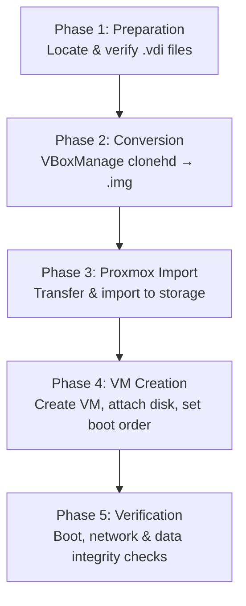

# VirtualBox to Proxmox VM Migration: Disk Conversion, Import & Verification

## Overview

A methodical migration of cybersecurity and network security virtual machines from Oracle VirtualBox to a Proxmox VE environment. This process preserves existing VM configurations while transitioning to a more robust, production-ready hypervisor with enhanced management capabilities.

**Key Objectives:**
- Migrate VirtualBox VMs to Proxmox VE with minimal downtime
- Preserve disk data and VM configurations
- Validate successful import and functionality
- Document the migration process for future reference

**Credit:** All credit for the migration methodology goes to [this documentation](https://static.xtremeownage.com/blog/2025/migrate-from-virtualbox-to-proxmox/). This page serves as a personal implementation record.

---

## Table of Contents

- [Migration Workflow](#migration-workflow)
- [Skills Demonstrated](#skills-demonstrated)
- [Implementation Steps](#implementation-steps)
- [Key Takeaways](#key-takeaways)
- [Troubleshooting Reference](#troubleshooting-reference)
- [Migrated VMs Overview](#migrated-vms-overview)

---

## Migration Workflow

```
VirtualBox (.vdi) → Raw Image (.img) → Proxmox VE Storage → Configured VM → Verified
```

```
┌─────────────────────────────────────────────────────────────────────┐
│                     MIGRATION WORKFLOW                              │
├─────────────────────────────────────────────────────────────────────┤
│                                                                     │
│  ┌───────────────────────────────────────────────────────────────┐  │
│  │                  PHASE 1: PREPARATION                         │  │
│  │  • Install VirtualBox Extension Pack                          │  │
│  │  • Locate .vdi files for each VM                              │  │
│  │  • Verify disk integrity                                      │  │
│  └───────────────────────────────────────────────────────────────┘  │
│                              │                                      │
│                              ▼                                      │
│  ┌───────────────────────────────────────────────────────────────┐  │
│  │                  PHASE 2: CONVERSION                          │  │
│  │  • Run VBoxManage clonehd for each disk                       │  │
│  │  • Verify .img files created                                  │  │
│  │  • Record file locations                                      │  │
│  └───────────────────────────────────────────────────────────────┘  │
│                              │                                      │
│                              ▼                                      │
│  ┌───────────────────────────────────────────────────────────────┐  │
│  │                  PHASE 3: PROXMOX IMPORT                      │  │
│  │  • Transfer .img files to Proxmox                             │  │
│  │  • Import to storage using web UI or command line             │  │
│  │  • Verify successful import                                   │  │
│  └───────────────────────────────────────────────────────────────┘  │
│                              │                                      │
│                              ▼                                      │
│  ┌───────────────────────────────────────────────────────────────┐  │
│  │                  PHASE 4: VM CREATION                         │  │
│  │  • Create VM with "Do not use any media"                      │  │
│  │  • Delete default disk                                        │  │
│  │  • Add imported disk(s)                                       │  │
│  │  • Configure boot order                                       │  │
│  │  • Start VM and verify                                        │  │
│  └───────────────────────────────────────────────────────────────┘  │
│                              │                                      │
│                              ▼                                      │
│  ┌───────────────────────────────────────────────────────────────┐  │
│  │                  PHASE 5: VERIFICATION                        │  │
│  │  • VM boots successfully                                      │  │
│  │  • Services functional                                        │  │
│  │  • Network connectivity verified                              │  │
│  │  • Data integrity confirmed                                   │  │
│  └───────────────────────────────────────────────────────────────┘  │
│                                                                     │
└─────────────────────────────────────────────────────────────────────┘
```

A text-native version, useful anywhere the diagram above doesn't render cleanly (e.g. viewing raw markdown):



### Environment

| Component | Specification |
| :---------------------- | :----------------------------------------- |
| **Source Hypervisor** | Oracle VirtualBox |
| **Target Hypervisor** | Proxmox VE |
| **Conversion Tool** | VBoxManage (VirtualBox command-line tool) |
| **Migration Host OS** | Windows |
| **Target Proxmox Node** | pve.lab |
| **Target Storage** | local |

### Virtual Machines Migrated

| VM Name | Primary Disk | Secondary Disk | Purpose |
| :------ | :----------- | :-------------- | :------ |
| **Cybersecurity LabVM Workstation Clone** | `disk1.vdi` | `disk2.vdi` | Cybersecurity analysis workstation |
| **CyberOps Security Onion Clone** | `disk1.vdi` | — | Network security monitoring (Security Onion) |

---

## Skills Demonstrated

| Category | Skills |
| :------- | :----- |
| **Virtualization Migration** | VirtualBox-to-Proxmox VM conversion; disk format conversion (VDI → RAW) |
| **Scripting & Automation** | PowerShell scripting for repeatable disk-conversion workflows |
| **Hypervisor Administration** | Proxmox VM creation, hardware configuration, and boot-order management |
| **Systems Troubleshooting** | Diagnosing disk bus type, network, and import failures |
| **Documentation** | Process documentation with verification checklists for repeatable migrations |

---

## Implementation Steps

### 1. Preparation

#### Install VirtualBox Extension Pack

Before beginning the migration, ensure the VirtualBox Extension Pack is installed on the source machine. This enables support for the disk formats and operations required during conversion.

#### Locate VM Disk Files

Identify the location of the `.vdi` disk files for each VM. Default location:
```
C:\Users\<username>\VirtualBox VMs\<VM_NAME>\
```

#### Verify Disk Files

Confirm the presence and integrity of all `.vdi` files for each VM. Note that some VMs may have multiple disks (e.g., `disk1.vdi`, `disk2.vdi`).

---

### 2. Disk Conversion (VirtualBox → Raw Image)

#### Tool

VBoxManage (VirtualBox command-line interface). Each `.vdi` disk must be converted to a raw `.img` format that Proxmox can import.

#### PowerShell Script Template

```powershell
# This needs to be set to the exact path of VBoxManage.exe
$VBoxManage = "C:\Program Files\Oracle\VirtualBox\VBoxManage.exe"
# Set this to the source .vdi file for your VM.
$InputVDI = "C:\Users\Wayne Altuama\VirtualBox VMs\<VM_NAME>\<DISK_NAME>.vdi"
# Set this path, to the output file for the raw disk image.
$OutputPath = "C:\Users\Wayne Altuama\VirtualBox VMs\<VM_NAME>\<DISK_NAME>.img"

# No need to touch this.
. $VBoxManage clonehd --format RAW $InputVDI $OutputPath
```

#### Example 1: Cybersecurity LabVM – Disk 1

```powershell
$VBoxManage = "C:\Program Files\Oracle\VirtualBox\VBoxManage.exe"
$InputVDI = "C:\Users\Wayne Altuama\VirtualBox VMs\Cybersecurity LabVM Worksation 20230210 Clone\Cybersecurity LabVM Worksation 20230210 Clone-disk1.vdi"
$OutputPath = "C:\Users\Wayne Altuama\VirtualBox VMs\Cybersecurity LabVM Worksation 20230210 Clone\Cybersecurity LabVM Worksation 20230210 Clone-disk1.img"

. $VBoxManage clonehd --format RAW $InputVDI $OutputPath
```

#### Example 2: Cybersecurity LabVM – Disk 2

```powershell
$VBoxManage = "C:\Program Files\Oracle\VirtualBox\VBoxManage.exe"
$InputVDI = "C:\Users\Wayne Altuama\VirtualBox VMs\Cybersecurity LabVM Worksation 20230210 Clone\Cybersecurity LabVM Worksation 20230210 Clone-disk2.vdi"
$OutputPath = "C:\Users\Wayne Altuama\VirtualBox VMs\Cybersecurity LabVM Worksation 20230210 Clone\Cybersecurity LabVM Worksation 20230210 Clone-disk2.img"

. $VBoxManage clonehd --format RAW $InputVDI $OutputPath
```

#### Example 3: CyberOps Security Onion – Disk 1

```powershell
$VBoxManage = "C:\Program Files\Oracle\VirtualBox\VBoxManage.exe"
$InputVDI = "C:\Users\Wayne Altuama\VirtualBox VMs\CyberOps Security Onion Clone\CyberOps Security Onion Clone-disk1.vdi"
$OutputPath = "C:\Users\Wayne Altuama\VirtualBox VMs\CyberOps Security Onion Clone\CyberOps Security Onion Clone-disk1.vdi.img"

. $VBoxManage clonehd --format RAW $InputVDI $OutputPath
```

#### Verification

Once conversion completes, verify the `.img` files exist at the specified output paths:

- [ ] `Cybersecurity LabVM Worksation 20230210 Clone-disk1.img`
- [ ] `Cybersecurity LabVM Worksation 20230210 Clone-disk2.img`
- [ ] `CyberOps Security Onion Clone-disk1.vdi.img`

---

### 3. Proxmox Import

#### Transfer Files to Proxmox

The `.img` files must be accessible to the Proxmox host. Options include:
- SCP/SFTP transfer from Windows to Proxmox
- Shared storage accessible by Proxmox
- Direct import via Proxmox shell

#### Import Disk Images to Proxmox

Using the Proxmox web interface or command-line:

**Web Interface Method:**
1. Navigate to your Proxmox node → `local` storage (or preferred storage)
2. Click "Import" → "Upload"
3. Select the `.img` file and upload


- [ ] Disk 1 imported successfully
- [ ] Disk 2 imported successfully (if applicable)
- [ ] All files visible in Proxmox storage

---

### 4. Virtual Machine Creation

#### Create New VM

1. In Proxmox web interface, click "Create VM"
2. Configure VM settings as needed (name, OS, resources)
3. Under the "OS" tab, select "Do not use any media"


> **Critical:** Under the "OS" tab, select "Do not use any media."

#### Remove Default Disk

1. During VM creation, skip the disk creation step
2. After VM is created, go to VM Hardware
3. Delete the default disk that was created

#### Import Migrated Disk

1. In VM Hardware → Add → "Add Hard Disk"
2. Select the imported `.img` file from storage
3. Ensure correct bus type (e.g., SCSI or IDE) matches the original VM configuration
4. Save changes


#### Adjust Boot Order

1. Go to VM Options → Boot Order
2. Ensure the imported disk is set as the first boot device

#### Additional Disk Configuration (for Multi-Disk VMs)

For VMs with multiple disks (e.g., the Cybersecurity LabVM with `disk1` and `disk2`):
1. Repeat the import process for each disk
2. Add each disk to the VM
3. Verify the boot order prioritizes the primary disk

---

### 5. Migration Verification

#### Pre-Migration Verification
- [ ] VirtualBox Extension Pack installed
- [ ] All `.vdi` files located and accessible
- [ ] Sufficient disk space for `.img` conversion

#### Conversion Verification
- [ ] `VBoxManage` command syntax verified
- [ ] All `.img` files successfully generated
- [ ] File sizes match expected disk sizes

#### Proxmox Import Verification
- [ ] `.img` files transferred to Proxmox
- [ ] Files visible in Proxmox storage
- [ ] Import completed without errors

#### VM Creation Verification
- [ ] VM created with "Do not use any media"
- [ ] Default disk removed
- [ ] Imported disk(s) added to VM
- [ ] Boot order configured correctly

#### Post-Migration Verification
- [ ] VM starts successfully
- [ ] OS boots without errors
- [ ] Network connectivity operational
- [ ] All services running as expected
- [ ] Data integrity verified

---

## Key Takeaways

| Concept | Lesson |
| :------ | :----- |
| **VBoxManage Tool** | `clonehd --format RAW` converts VirtualBox disks to raw format compatible with Proxmox |
| **Multi-Disk VMs** | Each disk requires separate conversion and import |
| **VM Creation** | Select "Do not use any media" to avoid conflicts with imported disks |
| **Disk Bus Type** | Match the original disk controller type (IDE/SCSI) for proper boot |
| **Boot Order** | Set imported disk as first boot device |
| **File Paths** | Use exact paths and verify file extensions during conversion |
| **Transfer Method** | Choose appropriate file transfer method based on file size |

---

## Troubleshooting Reference

| Issue | Likely Cause | Fix |
| :---- | :----------- | :-- |
| VBoxManage not found | Incorrect path to VBoxManage.exe | Verify installation path; use full path in script |
| Conversion fails with error | Insufficient disk space | Free up space or use external storage |
| Proxmox import fails | Incorrect file format | Ensure conversion completed; check file extension |
| VM won't boot | Wrong disk bus type | Change from SCSI to IDE or vice versa |
| Network not working | MAC address changed | Update network configuration in guest OS |
| VM hangs during boot | Disk controller mismatch | Adjust VM hardware settings to match original |
| Imported disk not visible | Storage not refreshed | Refresh storage view; check command output |

---

## Migrated VMs Overview

### 1. Cybersecurity LabVM Workstation Clone
- **Original OS:** Ubuntu
- **Disks:** 2 (disk1, disk2)
- **Purpose:** Cybersecurity analysis workstation
- **Status:** ✅ Migrated successfully

### 2. CyberOps Security Onion Clone
- **Original OS:** Ubuntu / Security Onion
- **Disks:** 1
- **Purpose:** Network security monitoring and threat analysis
- **Status:** ✅ Migrated successfully

---

**Environment:** Windows Host → Proxmox VE

**Migration Credits:** [Documentation Reference](https://static.xtremeownage.com/blog/2025/migrate-from-virtualbox-to-proxmox/)

---